# BVA Klausurfragen 2025

## 0.Overview [5]

**0.1 Wie kann man ein überbestimmtes Gleichungssystem lösen. Erläutern Sie die erforderlichen Schritte. Formen Sie die Gleichungen für ein konkretes BSP um, sodass via Matrix + Falk-Schema lösbar. Welche Vor- und Nachteile besitzt diese Strategie des Gleichungslösens?**

Ein überbestimmtes Gleichungssystem liegt vor, wenn die Anzahl der nicht-redundanten Gleichungen größer ist als die Anzahl der zu lösenden oder zu approximierenden Variablen. Im Allgemeinen lassen diese Gleichungssysteme keine eindeutige und exakte Lösung zu, weshalb ein Fehler pro Gleichung eingeführt wird.

Lösung eines überbestimmten Gleichungssystems:

Das Ziel bei der Lösung eines überbestimmten Gleichungssystems ist es, den Gesamtfehler als Funktion der quadrierten Differenzen zu minimieren, um die bestmögliche Annäherung an eine Lösung zu finden. Dies wird durch die Umformung in die sogenannte **Gaußsche Normalgleichung** erreicht.

**Erforderliche Schritte:**

1.  **Darstellung des Systems:** Das ursprüngliche überbestimmte Gleichungssystem wird in der Form Ax = B ausgedrückt, wobei A die Koeffizientenmatrix, x der Vektor der unbekannten Variablen und B der Ergebnisvektor ist.
2.  **Umwandlung in die Gaußsche Normalgleichung:** Um eine lösbare Form zu erhalten, multipliziert man beide Seiten der Gleichung Ax = B von links mit der Transponierten der Matrix A (Aᵀ). Dies führt zur Gaußschen Normalgleichung: **AᵀAx = Aᵀb**.
3.  **Lösung:** Die Gaußsche Normalgleichung kann dann durch verschiedene Methoden gelöst werden, unter anderem durch eine Erweiterung des **„Falk-Schemas“ der Matrixmultiplikation**. Die Lösung für x ergibt sich dann durch Multiplikation mit der Inversen von (AᵀA): **x = (AᵀA)⁻¹ * (Aᵀb)**.

TODO: Kontretes Beispiel

**Vorteile:**

* Diese Strategie ermöglicht die **näherungsweise Lösung von überbestimmten Gleichungssystemen**. Dies ist besonders nützlich in Anwendungsfällen wie der Registrierung oder Kamerakalibrierung, wo eine größere Anzahl von Referenzpunkten zur Stabilisierung des Ergebnisses und zur Annäherung einer Transformationsmatrix verwendet wird.

**Nachteile:**

* Ungenauigkeiten durch Gleitkommazahl-Arithmetik
* Beschränkung der Lösungseigenschaften

---

**0.2 Geben Sie eine (eigene) Definition für Computer Vision. Welche Disziplinen sind mit welchen Konzepten/Algorithmen involviert?**

Computer Vision ist eine Erweiterung der Bildverarbeitung, die sich mit der komplexen und fortgeschrittenen Bildanalyse befasst. Ihr Ziel ist es, gewünschte Strukturen in Bildern zu erkennen oder zu segmentieren, um ein vollständiges Bild- und Szenenverständnis zu ermöglichen. Die Eingabedaten können einzelne monokulare Bilder, Videostreams, 3D-Bilder, zusätzliche Sensordaten oder 3D-Oberflächenmodelle umfassen, oft auch große Mengen visueller Daten im Sinne von Big Data.

- **Bildverarbeitung**: Filterung, Bildrekonstruktion, Farbtransformationen, einfache Segmentierungsaufgaben.
- **Optik und Bildgebungssysteme**: Kamerakalibrierung, Verzerrung, 3D-Rekonstruktion.
- **Computergrafik**: Geometrische Modellierung, Formmodelle, Reflexionen, Beleuchtungsmodelle, Testdatengenerierung, 3D-Rekonstruktion, Ergebnisdarstellung.
- **Mustererkennung**: Texturen, SIFT (Scale-Invariant Feature Transform), VSLAM (Visual Simultaneous Localization and Mapping).
- **Robotik**: VSLAM, autonomes Fahren, Produktionsinspektion.
- **Künstliche Intelligenz und Heuristiken**: Merkmalsbasierte Klassifizierung, Registrierung, symbolische Repräsentation.
- **Mathematik, Numerik**: Projektive Geometrie, Wahrscheinlichkeiten, Statistik, Signalverarbeitung.

---

**0.3 Was sind klassische Anwendungsgebiete der Computer Vision?**

- **3D-Rekonstruktion aus planaren Bildern**
- **Erkennung (Recognition)**: die verschiedene Formen annehmen kann:
    - Erkennung von Markern und Objekten.
    - Gesichtserkennung, Iris-, Fingerabdruck-, Gesten- und Handschrifterkennung.
    - Erkennung der menschlichen Körperhaltung und Aktivitäten.
    - Optische Zeichenerkennung (OCR).
- **Klassifikation/Segmentierung**: um Objekte zu identifizieren und abzugrenzen:
    - Kontursegmentierung von Objekten, um gewünschte Objekte zu extrahieren und zu charakterisieren.
    - Semantische visuelle Klassifikation ganzer Bilder.
    - Komplexere Schlussfolgerungen aus Bilddaten unter Nutzung von Künstlicher Intelligenz (KI). Hierbei wird oft eine semantische Interpretation von Bildern als Voraussetzung benötigt, beispielsweise durch:
        - **Klassifikation (Classification)**: Das gesamte Bild wird mit einem "Wort" getaggt.
        - **Objektdetektion (Object Detection)**: Zusätzlich zur Klassifikation wird der Bereich von Interesse (ROI) um das potenziell verdeckte Schlüsselobjekt erkannt, sowohl für einzelne als auch für mehrere Objekte.
        - **Instanzsegmentierung (Instance Segmentation)**: Die präzise sichtbare oder verdeckte Pixelregion, die sich auf das klassifizierte Objekt bezieht, wird markiert.
- **Navigation**: insbesondere in autonomen Systemen: Autonomes Fahren an Land, unter Wasser und im Weltraum.
- **Mixed Reality (Erweiterte Realität)**: die reale und computergenerierte Objekte verschmilzt.
- **Synthetische Bilder**: Morphing und computergenerierte Bilder (z.B. in Filmen)

---

**0.4 Welche Bildeigenschaften sind für die menschliche Wahrnehmung relevant?**

- Oberflächenfarbe
- 3D-Sehen aufgrund der Parallaxe der menschlichen Augen
- Beleuchtung/Schattierung zur Annäherung von 3D-Form und Entfernung
- Bildtextur
- Form- und Oberflächeneigenschaften
- A-priori-Wissen über gelernte Objekte, deren Größe und 3D-Struktur
- Stereotypisches Denken als "Kurzschluss" für das menschliche Erkennungssystem

---

**0.5 Skizzieren Sie Computer Vision mit den relevantesten Verfahren grob als Wissenslandkarte.**

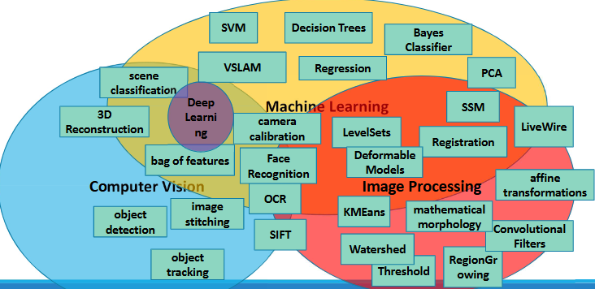

---
## 1.Linear Imaging Systems [9]

1.1 Rotation in 2D: welche zwei Möglichkeiten gibt es hierfür? Fertigen Sie eine Skizze an. 

1.2: Wie viele Rotationswinkel gibt es in 3D. Wie groß Matrix für Translation, Rotation, Skalierung in 3D. Warum 4x4. Wo kommt fehlende 4-te Koordinate in 3D her? Sind affine Transformationen kommutativ? Zeigen Sie anhand eines 2D Beispiels mit Rot/Trans, dass NICHT kommutativ.

1.3 Intrinsische vs. Extrinsische Rotation, d.h. Objekt- bzw. Koordinatensystem-bezogen. Vgl. Vor und Nachteile. Welche Eigenheit gibt es bei der Überführung von extrinsisch nach intrinsisch (Rot-Reihenfolge dreht sich um)

1.4 Was bedeutet Kamera-Kalibrierung? Wo liegen die Anwendungsgebiete und welche generellen Einschränkungen können Abbildungssystemen anhaften (distortion, keine echten Farben, usw.)

1.5 Warum kommt es bei der Camera Obscura zu Unschärfe? Fertigen Sie eine Skizze an und diskutieren Sie wovon es abhängt, dass ein Bild mittels Camera Obscura vergrößert oder verkleinert wird. Konnex zu adaptiven Filtern zwecks Korrektur

1.6 Welche intrinsischen und extrinsischen Parameter als Matrizeninhalte sind bei der Kamera-Kalibrierung zu lösen? Beschreiben Sie jeden der Parameter. Warum gibt es 2 Parameter für die Fokuslänge (x,y)? Durch welche weiteren Parameter kann eine Verzerrungskorrektur erfolgen?

1.7 Welche grundlegenden 3 geometrischen Probleme können mittels Kamera Kalibrierung gelöst werden? Erläutern Sie ev. mit Skizze.

1.8 Beschreiben Sie den Verfahrensablauf bei der Kalibrierung einer Kamera (Schachbrett-Muster).

1.9 Erläutern sie grob, wie die Gleichungen zur Kalibrierung einer Kamera definiert und gelöst werden können. Ev. mit Skizze.

---
## 2. Segmentation and Classification [8]

2.1 Differenzieren Sie die Begriffe Klassifikation, Segmentierung und Lokalisierung für ein BSP mit 1-N Objekten.

2.2 Wie kann man mittels MeanShift eine Vorsegmentierung bewirken, wie mittels KMeans Clustering + Quantisierung/Region Labelling, wie mittels Anisotroper Diffusion + Quantisierung/Region Labelling? Vergleichen Sie und erläutern Sie kurz.

2.3 Erläutern Sie kurz Graph Cut / Grab Cut. BG und FG-Wurzeln im Graph, Kantengewichte und Schnitt. Wie kann mittels Benutzerinteraktion ein verbessertes Ergebnis bewirkt werden?

2.4 Diskutieren Sie bei der OCR die technischen Hürden für a) die Erkennung von Text-Passagen und b) für die eigentliche Analyse der Buchstaben. Nennen Sie die dafür jeweils notwendigen verfahren.

2.5 Nennen Sie einige relevante Features aus dem Bereich Textur, Geometrie und Transformation. Welche dieser Features können auch im Bereich OCR zur Analyse von binären Buchstaben innerhalb einer region of interest (ROI) verwendet werden? Inwieweit beinhalten klassische Segmentierungsverfahren wie Interval-Threshold oder Region-Growing ebenfalls Features?

2.6 Erläutern Sie das Vorgehen, wenn man OCR „von 0 weg“ eigenständig umsetzen möchte auf Basis von vorsegmentierten Regionen und Featureanalyse für die Klassifikation (vgl. Übung).

2.7 Was sind Haar Cascades? Wie werden sie trainiert und angewandt? Inwieweit ist das Konzept skalierungsinvariant? Führen Sie über die Bedeutung der Haar Cascade im Bereich der

2.8. Nennen und Diskutieren Sie alternative Ansätze zur Gesichtserkennung (historische Verfahren bis hin zu aktuellen Strategien) und charakterisieren Sie dabei jeweils die Vor- und Nachteile.

 
---
## 3. Image Restauration [5]

3.1 Erläutern Sie die Idee der Anisotropen Diffusion mit eigenen Worten. Was bedeutet die lokale Diffusionszahl ? Was bedeutet K? Wird c für jedes Pixel individuell berechnet?  Wird K für jedes Pixel individuell berechnet?  Wie viele Gradientenrichtungen sind für jedes Pixel zu betrachten?

3.2 Was bedeutet „image degradation“. Filterung im Ortsraum vs. Frequenzraum. Sehen Frequenz-Spektren von natürlichen Bildern ähnlich aus? Wie kann man das nun zur Beseitigung von Störsignalen nützen? Warum muss bei der „deconvolution“ im Falle von Rauschen der hohe Frequenzbereich abgeschwächt werden (Skizze).

3.3 Die Wiener-Deconvolution kann mittels Wiener-Filterkern erfolgen, wobei K welche Bedeutung zukommt? ( Abschätzung des Signal-Rausch-Verhältnis). Wie kommt man zu K? Wie vereinfacht sich die Wiener-Deconvolution, wenn kein Rauschen im Bild vorhanden ist.

3.4 Muss bei der Richardson-Lucy-Deconvolution der Faltungskernel bekannt sein, der das Störsignal verursacht? Erläutern Sie in eigenen Konzepten grob, wie mittels RLD ein verzerrtes Bild wieder rekonstruiert werden kann.

3.5 Was bedeutet Image Superresolution? Nennen Sie unterschiedliche Strategien und erläutern Sie das Grundprinzip sehr vereinfacht mit eigenen Worten. Wo liegen die Grenzen der Image Superresolution?

---
## 4. Localization [10]

**4.1 Erörtern Sie die Kernidee von VSLAM anhand einer eigenen Skizze und führen Sie in diesem Zusammenhang über die loop closure aus. In welchen Anwendungsdomänen spielt der VSLAM Algorithmus eine zentrale Rolle?**

Visual SLAM verwendet hauptsächlich visuelle Informationen, also Kameradaten, zur simultanen Lokalisierung und Kartierung. Kameras erfassen visuelle Merkmale der Umgebung, und der Algorithmus berechnet daraus die Position des Geräts.

- Ziel: Lokalisierung des Roboters und simultane Erstellung einer Karte der Umgebung.
- Input: Visuelle Sensordaten (monokular/stereo), oft kombiniert mit interner Odometrie.
- Herausforderung: Henne-Ei-Problem — Für die Lokalisierung wird eine Karte benötigt; für die Kartierung wird eine präzise Lokalisierung vorausgesetzt.

**Ablauf und Konzept**

    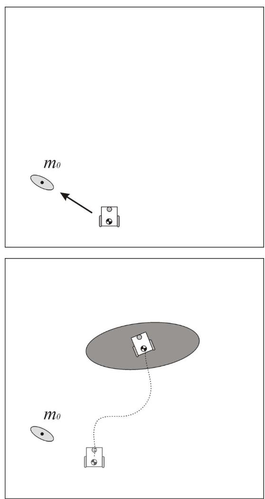
    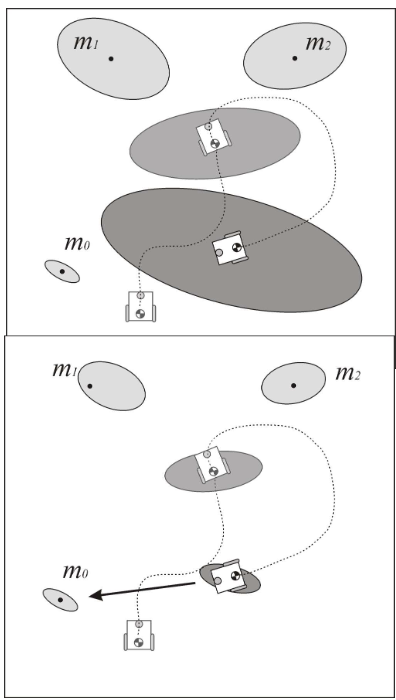

1. Start: Roboter beginnt bei Pose (0,0); Umgebung ist unbekannt.
2. Bewegung gemäß interner Odometrie (Positionsschätzung), erste Unsicherheiten entstehen.
3. Beobachtung erster Merkmale (z.B. durch SIFT); Position dieser Features ist nur ungenau bekannt.
4. Weitere Bewegung: Fehler in Pose-Schätzung akkumulieren.
5. **Loop Closure:** Ein zuvor gesehenes Merkmal wird erneut erkannt. Dies erlaubt Korrektur von Pfad und Karte durch Optimierung.
    - Führt zu signifikanter Reduktion kumulierter Fehler.
    - Erhöht Vertrauen in die Lokalisierung und die Kartengenauigkeit.
    - Ist entscheidend für globale Konsistenz der Karte.

**Anwendungsdomänen von VSLAM**
- Autonome Fahrzeuge – Navigation ohne GPS, z.B. in Tunneln oder Städten.
- Rettungsroboter – Kartierung unbekannter Gebiete (z.B. Höhlen, eingestürzte Gebäude).
- Haushaltsroboter – Staubsauger, Rasenmäher: systematische Umgebungserfassung.
- Augmented Reality / Virtual Reality – Echtzeitlokalisierung von mobilen Kameras.
- Drohnen / UAVs – Umgebungserkennung für autonome Flugnavigation.

---

**4.2 Hough-Transformation von Linien (konventionelle Geradengleichung – keine Polarkoordinaten): Linie im Ortsraum wird zu Punkt im Parameterraum. Geradengleichung + Skizze. Wie kann nun damit eine Linie als lokales Max. im Parameterraum detektiert werden (Skizze)**

Ein Punkt im Ortsraum $(x_0, y_0)$ entspricht einer Geraden im Parameterraum $(m, b)$, gemäß:

  $$
  b = -x_0 \cdot m + y_0
  $$

* Für jedes Pixel im Bild (Ortsraum) wird diese Gleichung genutzt, um alle möglichen Geraden zu berechnen, die durch diesen Punkt verlaufen könnten -> **je ein Linienzug im Parameterraum**.

* **Im Parameterraum**:
  * Wenn sich viele dieser Linien in einem Punkt schneiden, bedeutet das, dass mehrere Pixel im Bild auf derselben Linie im Ortsraum liegen.
  * Der Schnittpunkt ist ein lokales Maximum im Akkumulator, das eine detektierte Linie repräsentiert.

    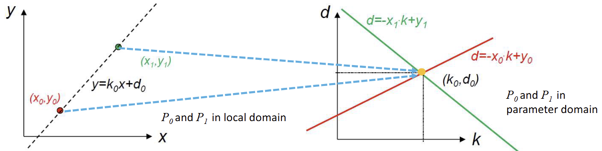

---

**4.3 Welche Parameter sind bei der Darstellung von Kreisen im Parameterraum sinnvoll.**

Ein Kreis im Ortsraum wird durch folgende Parameter beschrieben:
* $a, b$: Mittelpunkt des Kreises
* $r$: Radius

**Wie manifestiert sich ein Punkt dabei im Parameterraum?**

Punkt im Ortsraum -> Kreis im Parameterraum:

* Ein einzelner Bildpunkt $(x_0, y_0)$ könnte auf vielen möglichen Kreisen liegen.
* Für jeden möglichen Radius $r$ ergibt sich eine Kreislinie im Parameterraum (a, b), auf der der Mittelpunkt (des Kreises aus dem Ortsraum) liegen müsste.
* Das heißt: **Ein Punkt im Ortsraum wird zu einer Kreislinie im Parameterraum**.

**Wie sind dadurch Kreise zu detektieren? Ev. BSP**

* Für viele Punkte im Bild (z. B. Kantenpunkte): Berechne alle möglichen Kreismittelpunkte für feste Radien.
* Im **dreidimensionalen Parameterraum $(a, b, r)$**:

  * Viele Punkte erzeugen viele Kreislinien.
  * Wo sich viele dieser Linien schneiden, liegt ein lokales Maximum -> ein echter Kreis ist erkannt.

    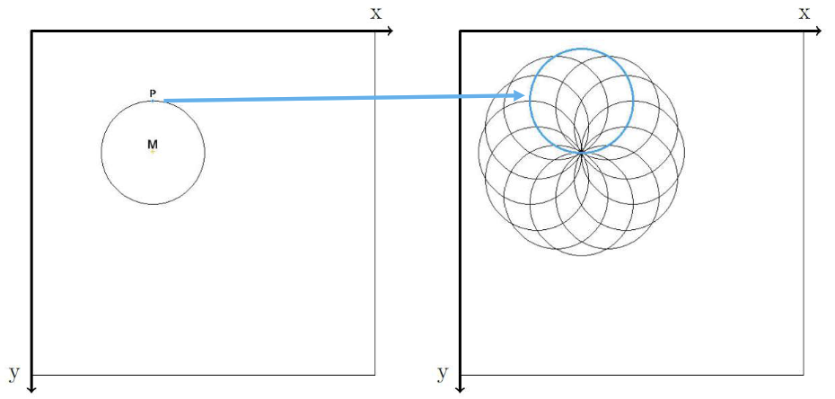

---

**4.4 Warum wird die Generalized Hough Transformation benötigt?**

Die normale Hough-Transformation funktioniert nur bei einfachen Formen (Linien, Kreise). Für beliebige Formen (z. B. komplizierte Konturen) braucht man die generalizierte Hough Transformation.

**Wie wird die R-Tabelle errechnet? Hat die R-Tabelle die Bedeutung eines „Form-Modelles“?**

* Ein **Referenzpunkt** $P_c = (X_c, Y_c)$ wird gewählt (z. B. Mittelpunkt).
* Für jeden **Konturpunkt** $P_i = (X_i, Y_i)$:

  * Berechne den Abstand $r_i$ zum Referenzpunkt.
  * Bestimme die Kantenrichtung $\phi$ (z. B. mit Sobel-Operator).
  * Berechne den Winkel $\alpha_i$ zwischen $P_i$ und $P_c$.
* Die Werte $(r_i, \alpha_i)$ werden in der R-Tabelle nach Winkel $\phi$ sortiert gespeichert.

Ja, die R-Tabelle ist das Modell der Form.

    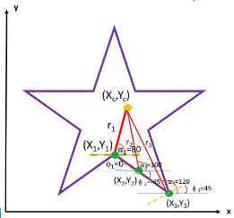
    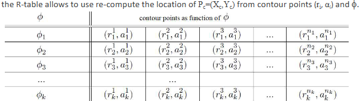

**Erhöht sich die Genauigkeit des Modells, wenn mehr Punkte entlang der Kontur in die R-Tabelle verspeichert werden?**

Ja, mehr Punkte in der R-Tabelle = genaueres Modell.

**Was ist die Bedeutung vom Index phi und wie kann man die lokale Steigung der Kontur berechnen.**

φ ist der Winkel der Kante am Konturpunkt (lokale Richtung), berechnet aus dem **Gradienten** ($g_x, g_y$). Damit sucht man passende Vektoren in der R-Tabelle.

**Wie berechnet man die lokale Steigung der Kontur?**
Mit den **x- und y-Gradienten**, z. B. aus dem **Sobel-Filter**:

$$
\phi = \arctan\left(\frac{g_y}{g_x}\right)
$$

**Erlaubt die R-Tabelle das Rekonstruieren von Mittelpunkten ($P_c$) der Form?**
Ja, durch Rückrechnung mit den gespeicherten Werten $(r_i, \alpha_i)$ und dem Winkel $\phi$.

---

**4.5 Was sind gute lokale Features in Bildern und warum?**

Gute lokale Features sind Ecken oder Kanten, also Bildbereiche mit starken Änderungen in mehreren Richtungen. Homogene Flächen sind ungeeignet, da sie keine markanten Merkmale enthalten.

    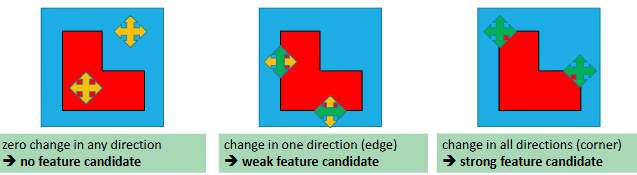

**Motivieren Sie die Bedeutung von lokalen Features für unterschiedliche Anwendungsdomänen (Panoramafotos, 3D Rekonstruktion, Tracking, Objekterkennung,…).**

Sie helfen, markante Punkte wiederzuerkennen, z. B. für:
- Panoramafotos: Bilder zusammensetzen
- 3D-Rekonstruktion: gleiche Punkte aus verschiedenen Blickwinkeln (mehrere Kameras)
- Tracking: Objektverfolgung über Zeit
- Objekterkennung: bekannte Formen wiederfinden
- Robotik (z. B. visuelle Navigation)

**Welche Anforderungen und Qualitätsindikatoren werden an lokale Features gestellt?**

- Repetitivität: gleiche Punkte zuverlässig finden, auch in mehreren Bildern
- Affine Invarianz: robust gegen Translation, Rotation, Skalierung
- Robustheit: stabil trotz Rauschen, Unschärfe, Helligkeitsänderung
- Unverwechselbarkeit (Distinctiveness): sollte einzigartige Strukturen zeigen
- Ausgewogene Anzahl: genug, um das Bild gut zu beschreiben, aber nicht zu viele
- Effizienz: schnell genug für Echtzeitanwendungen (z. B. Tracking)

---

**4.6 Welche Features werden beim Hessian/Harris Corner Detector erkannt und wie?** 
Beide Verfahren erkennen Ecken, also Punkte mit starkem Intensitätswechsel in mehreren Richtungen.

- Hessian-Detektor: Schaut sich an, wie stark sich Helligkeit in x- und y-Richtung ändert (mit 2. Ableitungen). Wenn sich in beiden Richtungen viel verändert, erkennt er eine Ecke.
- Harris-Detektor: Nutzt 1. Ableitungen (also wie schnell Helligkeit sich ändert) und baut daraus eine Matrix. Wenn sich die Helligkeit in mehreren Richtungen gleichzeitig stark ändert, sind beide Eigenwerte groß, das ist eine Ecke. Die Ecke wird erkannt, wenn ein gewisser Schwellwert überschritten wird.

**Welche Bedeutung haben in diesem Zusammenhang Gradienten, die Hesse Matrix sowie Eigenwerte?**
- Gradienten: Zeigen, wie stark und in welcher Richtung sich die Helligkeit im Bild ändert (1. Ableitungen in x- und y-Richtung). Grundlage für die Eckenerkennung, da Ecken starke Helligkeitswechsel in mehreren Richtungen zeigen.

- Hesse-Matrix (Hessian): Verwendet die 2. Ableitungen der Helligkeit (also wie stark sich der Gradient selbst ändert). Gibt Auskunft darüber, ob die Änderung stark genug ist und in welchen Richtungen Struktur im Bild vorhanden ist. Eine große Determinante der Hesse-Matrix bedeutet, dass sich die Helligkeit in x- und y-Richtung stark ändert -> mögliche Ecke.

- Eigenwerte (bei Harris & Hessian): Zeigen die Stärke der Änderungen in den Hauptachsen (Richtungen) der Matrix.
    - Beide Eigenwerte groß: starke Änderung in zwei Richtungen -> Ecke
    - Ein Eigenwert groß, der andere klein: Kante
    - Beide klein: Fläche ohne Struktur

**Welche Anwendungsdomänen gibt es, bei denen Feature-Detektion essentiell ist?**

- Panoramafotos: Bilder zusammensetzen
- 3D-Rekonstruktion: gleiche Punkte aus verschiedenen Blickwinkeln (mehrere Kameras)
- Tracking: Objektverfolgung über Zeit
- Objekterkennung: bekannte Formen wiederfinden
- Robotik (z. B. visuelle Navigation)

---

**4.7 Was bedeutet scale invariance?**

Scale Invariance (Skalierungsunabhängigkeit) bedeutet, dass ein Feature-Detektor Merkmale erkennt, egal wie groß oder klein das Objekt im Bild erscheint (z.B. durch Entfernung oder Zoom).

Klassische Detektoren wie Harris/Hessian sind nicht scale-invariant. Ein Objekt, das bei kleiner Skalierung ein scharfes Detail zeigt, kann bei größerer Skalierung glatt und unauffällig wirken -> wird dann nicht mehr als Feature erkannt.

**Wie kann man Skalierungsunabhängigkeit erzielen, vgl. Filterpyramide, SIFT etc.**

Lösung: Verwendung von Scale Spaces
-> Bilder werden in verschiedenen Auflösungen (Skalen) betrachtet.

    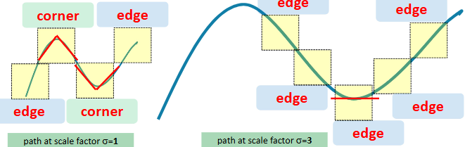

1. Filterpyramide: 
- Das Bild wird mehrfach geglättet (durch Gaussian-Filter mit verschiedenen σ) und runterskaliert.
- Feature-Detektion wird auf allen Ebenen wiederholt. So kann man Features in verschiedenen Größen finden.

2. SIFT (Scale-Invariant Feature Transform): Baut einen skalierbaren Bildraum auf, indem das Bild mit verschiedenen Gaussian-Filtern bearbeitet wird. Aus den gefilterten Bildern werden dann Differenzbilder (Difference of Gaussian, DoG) gebildet.

**Erläutern Sie Difference of Gaussian und wie dadurch Skalierungsunabhängigkeit erzielt werden kann.**

DoG ist die **Differenz zweier geglätteter Bilder**, die mit zwei leicht unterschiedlichen Sigma-Werten gefiltert wurden. Man zieht das stärker geglättete Bild vom weniger geglätteten ab.

    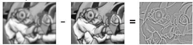

**Warum macht man das?**: Diese Differenz hebt Bereiche hervor, in denen sich die Helligkeit im Bild stark ändert, das sind Kanten oder Ecken.

**Skalierungsunabhängigkeit**:
* Indem man DoG auf verschiedenen Skalen (also für viele verschiedene σ) berechnet, betrachtet man das Bild aus mehreren "Entfernungen".
* Auf kleinen Skalen sieht man feine Details, auf großen Skalen sieht man grobe Strukturen.
* Sucht man nun lokale Maxima oder Minima im Raum aus (x, y, σ), findet man Punkte, die auf allen Skalen gut erkennbar sind. Diese Punkte sind skalierungsinvariant, weil sie nicht von der Größe des Objekts abhängen, sondern von seiner Struktur über Skalen hinweg.

In SIFT nutzt man genau diese DoG-Extrema als stabile Merkmale, die man auch dann wiederfindet, wenn ein Objekt im Bild größer oder kleiner erscheint. So ist der Algorithmus robust gegenüber Zoom oder Entfernung.

---

**4.8 Wie wird bei SIFT der 128-Element Feature-Vektor errechnet.**

1. **Vorbereitung (Steps 1-3):**
SIFT detektiert zunächst stabile Keypoints über mehrere Skalen (DoG-Pyramide), lokalisiert sie präzise und weist jedem Keypoint eine dominante Orientierung zu, um Rotationsinvarianz zu gewährleisten.

2. **Step 4 – Keypoint Description:**
* Um jeden Keypoint wird ein 16x16 Pixel großes lokales Umfeld betrachtet.
* Dieses Umfeld wird in 16 kleine Regionen (4x4 Pixel) aufgeteilt.
* In jeder Region wird ein Histogramm der lokalen Gradientenorientierungen mit 8 Bins erstellt.
* Die Gradientenwerte werden mit einer Gauß-Gewichtung und der Gradientenstärke gewichtet.
* Die 16 Histogramme mit je 8 Werten werden aneinandergereiht -> ergibt den 128-dimensionalen Feature-Vektor (16 x 8 = 128).
* Abschließend wird der Vektor normalisiert, um Beleuchtungsänderungen robust zu begegnen.
    

        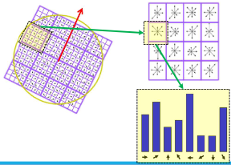
    

**Was bedeutet in diesem Zusammenhang Feature-Trajektorie und wie werden Features diesbezüglich „gematched“?**

Feature-Trajektorie: Die Verbindung eines SIFT-Features aus Bild A mit dem korrespondierenden Feature aus Bild B, also die Zuordnung von Merkmalen zwischen zwei Bildern.

Matching:
* Beim Matching sucht man für jeden Feature-Vektor aus Bild A den ähnlichsten Feature-Vektor aus Bild B (meist mit der euklidischen Distanz).
* Um sicherzugehen, dass die Zuordnung zuverlässig ist, wird der Ratio-Test angewendet: Nur wenn der beste Match deutlich besser ist als der zweitbeste (z.B. mindestens 20% besser), wird die Verbindung akzeptiert.
* So entstehen stabile Feature-Trajektorien zwischen Bildern.

**Angenommen es werden zwei Mengen an SIFT-Features mittels Feature-Trajektorie in Verbindung gesetzt – wie kann die Ergebnisqualität zusätzlich verbessert werden?**

Clusterbildung und Hough-Transform:
* Features, die zusammen ähnliche Bewegungen oder Transformationsparameter (z.B. affine Transformation) aufweisen, werden zu Clustern zusammengefasst.
* Mittels Hough-Transform stimmen die Keypoints über mögliche Objektpositionen und -orientierungen ab.
* Der Cluster mit den meisten "Votes" repräsentiert die wahrscheinlichste Übereinstimmung, was die Zuverlässigkeit gegenüber Ausreißern und falschen Matches deutlich erhöht.

---

**4.9 Erläutern Sie das Histogram of Oriented Gradients (HOG).**

HOG ist ein Verfahren zur Beschreibung von Bildern, das vor allem für die Erkennung von Objekten (z.B. Personen) eingesetzt wird. Es analysiert die Verteilung von Kantenrichtungen in kleinen Bereichen eines Bildes.

**Welche zentralen Features werden hierbei zur Berechnung des L2-normalisierten 36-bin Feature-Vektors herangezogen?**

1. **Gradientenberechnung:**

* Zuerst werden horizontale und vertikale Gradienten mit Sobel-Filtern berechnet.
* Daraus ergeben sich für jeden Pixel die Gradientenstärke (Magnitude) und die Gradientenrichtung.
    

        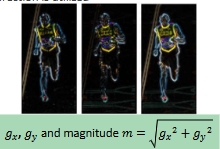
    

2. **Histogramme pro Pixelzelle:**

* Das Bild wird in kleine Zellen von z.B. 8×8 Pixeln unterteilt.
* Für jede Zelle wird ein Histogramm der Gradientenrichtungen berechnet, aufgeteilt in 9 Bins (also 9 Winkelbereiche von 0° bis 180°, da die Gradientenrichtung "unsigned" ist).
    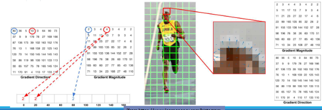
* Die Gradienten werden gewichtet nach ihrer Stärke und auf die beiden nächsten Bins verteilt (Interpolation).
    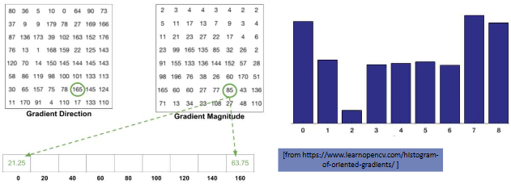
    

3. **Block-Normalisierung:**

* Vier benachbarte Zellen (also 2x2 Zellen = 16×16 Pixel) werden zusammengefasst zu einem Block.
* Die 4 Histogramme (je 9 Bins) ergeben einen Vektor mit 36 Werten (4×9).
* Dieser Vektor wird L2-normalisiert (auf die Länge 1 skaliert), um Beleuchtungsunterschiede auszugleichen (beschreibt nur die relative Verteilung der Kantenrichtungen, nicht die absolute Stärke).
    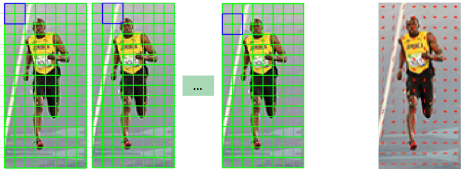

4. **Endergebnis:**

* Das Bild wird von vielen solchen Blöcken abgedeckt, und die 36-Element-Vektoren dieser Blöcke werden aneinandergereiht, um den endgültigen HOG-Feature-Vektor zu bilden.

**Wie wird HOG invariant bzgl. affiner Transformationen wie etwa Skalierung, Translation oder Rotation?**

* **Skalierung:**
    Durch Vorverarbeitung wird das Bild auf eine standardisierte Größe skaliert, sodass die Größe der Zellen und Blöcke relativ zum Bild konstant bleibt.

* **Translation (Verschiebung):**
    HOG arbeitet lokal in kleinen Zellen und Blöcken, deshalb verschieben sich die lokalen Histogramme mit dem Bildinhalt mit und bleiben konsistent.

* **Rotation:**
    HOG verwendet „unsigned“ Gradienten (0° bis 180°), wodurch eine 180°-Rotation oder Spiegelung weniger Einfluss auf den Histogrammverlauf hat.

---

**4.10 Erläutern Sie die Bedeutung von Bild-Charakteristika zur Segmentierung/Klassifikation. Warum muss dabei i.d.R. ein Feature-Vektor verwendet werden, um mehrere Klassen in robuster Weise voneinander trennen zu können.**

Man nutzt mehrere Bild-Charakteristika gleichzeitig in einem Feature-Vektor, um verschiedene Klassen zuverlässig voneinander zu trennen, da einzelne Merkmale oft zu ungenau oder irreführend sind. Mehr Merkmale = bessere Unterscheidungskraft.

* **Bild-Charakteristika** sind Merkmale oder Eigenschaften eines Bildes (z.B. Farbe, Textur, Kanten, Form), die helfen, verschiedene Bildbereiche oder Objekte zu unterscheiden.
* Bei der **Segmentierung** werden Bildbereiche in sinnvolle Teile (z.B. Himmel, Boden, Objekte) getrennt.
* Bei der **Klassifikation** wird jedem Bild oder Bildteil eine Kategorie (Klasse) zugewiesen, z.B. „Auto“, „Mensch“ oder „Hintergrund“.

Warum ein Feature-Vektor:
* Ein einzelnes Merkmal (z.B. nur Farbe) ist oft nicht ausreichend, weil verschiedene Klassen sich in einem Merkmal überlappen können.
* Ein Feature-Vektor fasst viele verschiedene Merkmale zusammen (z.B. Farbe, Textur, Form, Kantenmuster). Dadurch kann man besser Unterschiede erkennen.

---

---
## 5. 3D Rekonstruktion [6]

5.1 Nennen Sie Verfahren, um mit einzelnen monokularen Bildern bzw. mehrerer monokularer Bilder Objekte 3D zu rekonstruieren. Vergleichen Sie die Ansätze.

5.2 Nennen Sie Anwendungsgebiete der 3D Rekonstruktion. Geben Sie eine Definition für "3D Rekonstruktion" in eigenen Worten. Erläutern Sie, warum in 2D Bildern die Größe von Objekten nicht ableitbar ist

5.3 Führen Sie über die Größenbestimmung in Bildern via Referenzobjekte aus. Erläutern Sie Shape from Shading.

5.4 Erläutern Sie Deep Depth from Focus. Erläutern Sie Shape from texture / structured light

5.5 Führen Sie über den Einsatz von Deep Learning zur Bestimmung der Tiefe / 3D Form aus.

5.6 Erläutern Sie Stereo Matching und Structure from Motion. Welche Bilder sind dafür gut geeignet? Erläutern Sie die Silhouette Reconstruction.

---
## 6. Computer Vision and Machine Learning [9]

**6.1 Wofür werden Bilddatenbanken als „ground-truth“ benötigt.**

Ground-truth bedeutet die exakte Referenz, also eine genaue, verlässliche "Wahrheit" über Bildinhalte (z.B. korrekte Segmentierung, Klassifikation).

Bilddatenbanken mit Ground-truth werden gebraucht, um:
  * Algorithmen in der Computer Vision zu trainieren und zu testen.
  * Ergebnisse verschiedener Verfahren objektiv zu vergleichen.
  * Zu überprüfen, wie gut eine Methode wirklich arbeitet.

**Welche Daten sind dabei hilfreich (vgl. Bilddaten, Depth-from-Focus, 3D Rekonstruktion).**

* Bilddaten mit genauen Labels (z.B. was ist Objekt, Hintergrund, welche Klasse).
* Depth-from-Focus Daten: zusätzliche Tiefeninformationen, um Objekte besser zu unterscheiden.
* 3D Rekonstruktion: 3D-Modelle oder Volumen helfen, räumliche Strukturen exakt zu erfassen.

---

**6.2 Was sind die Fallstricke bei der Verwendung von Bilddatenbanken?**

* **Begrenzte Realitätsnähe:** Bilddatenbanken zeigen nur einen kleinen Ausschnitt der realen Welt, viele Situationen fehlen.
* **Qualität der Daten:** Ground-truth ist nicht immer korrekt oder vollständig, es gibt Fehler, Lücken und Verzerrungen.
* **Bias:** Bilder können z.B. bevorzugte Blickwinkel (Autos nur von der Seite) oder typische Posen enthalten, was das Training einseitig macht.
* **Redundanz:** Viele Daten enthalten sehr ähnliche oder gleiche Motive, was die Vielfalt einschränkt und Modelle überoptimiert auf diese speziellen Beispiele.
* **Visuelle Herausforderungen:** Probleme wie Schatten, Blendungen, Reflexionen, schlechte Beleuchtung oder Verdeckungen werden oft nicht oder nur unzureichend abgebildet.
* **Unterschiedliche Test- und Realitätsszenarien:** Algorithmen, die in Benchmarks gut abschneiden, können im echten Einsatz stark schlechter sein.

---

**6.3 Wie kann man Datenbanken „anreichern“, wenn nicht genügend Testdaten verfügbar sind?**

1. Datenaugmentation durch Transformationen:

* Bilder spiegeln (horizontal/vertikal)
* Helligkeit, Kontrast oder Farben verändern (z.B. Gamma-Korrektur)
* Affine Transformationen: drehen, verschieben, skalieren, verzerren
* Künstliches Hinzufügen von Rauschen oder Objekten
* Sub-Bilder (Ausschnitte) von wichtigen Bildteilen erstellen
* Ersetzen von Bildteilen, z.B. Gesichter in Videos austauschen
* Einfügen von computergenerierten Bildern (CGI) in bestehende Szenen

2. Automatisches Hinzufügen ähnlicher Bilder aus dem Internet:

* Bilder von Suchmaschinen (Google, Flickr) abrufen
* Automatische Annotation (Labeln) mit wenig manuellem Aufwand durch Ähnlichkeitssuche
* Schrittweise Erweiterung des Datensatzes basierend auf Ähnlichkeit (Feedback-Loop)

3. Transfer Learning mit vortrainierten Deep CNNs:

* Vortrainierte Netzwerke (z.B. auf ImageNet) als Ausgangspunkt nehmen
* Auf kleinere, domänenspezifische Datensätze (z.B. Blumenarten) weitertrainieren (Feinabstimmung)
* Vorteil: Gute Grundkenntnisse werden erweitert, es braucht weniger neue Daten

4. Nutzung von 3D-Modellen zur Generierung von Bildern:

* 3D-Objekte digital rendern (realistische Bilder erzeugen)
* Verschiedene Perspektiven und Posen simulieren (z.B. für Menschen, Fahrzeuge)
* Dadurch kann der Datensatz gezielt und vielfältig erweitert werden

**Was ist diesbezüglich der Vorteil/Nachteil von simulierten [Bild]daten?**

Vorteile von simulierten Bilddaten (z.B. aus 3D-Modellen)

* Kontrollierte Vielfalt: Man kann gezielt verschiedene Ansichten, Posen, Beleuchtungen erzeugen.
* Unbegrenzte Datenmenge: Es können beliebig viele Bilder generiert werden.
* Exakte Annotation: Da alles simuliert ist, sind Labels und Tiefeninformationen perfekt verfügbar.
* Geringerer Aufwand für manuelles Labeln.

Nachteile von simulierten Bilddaten

* Realitätslücke: Simulierte Bilder können von echten Bildern abweichen (Domänenunterschiede).
* Weniger natürliche Variationen: Manche Bildfehler oder Störungen fehlen (z.B. Kamerarauschen, Reflexionen).
* Aufwendige Erstellung: Hochrealistische 3D-Modelle und Rendering benötigen viel Aufwand und Rechenleistung.

---

**6.4 Führen Sie detailliert über Datenaugmentierung sowie Tools zur semi-automatischen Annotation von Bildern aus.**

Datenaugmentierung ist eine Methode, um vorhandene Bilddaten künstlich zu erweitern, indem Variationen der Originalbilder erzeugt werden. Ziel ist es, die Datenmenge zu erhöhen und gleichzeitig die Robustheit von Modellen gegen unterschiedliche Bildvariationen zu verbessern.

Methoden: Spiegeln, Drehen, Skalieren, Farb- und Kontraständerungen, Rauschen hinzufügen, Zufallsausschnitte.

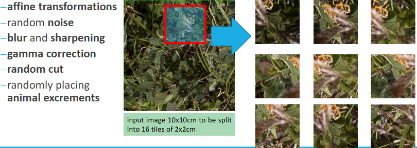

Semi-automatische Annotation:
Der Computer schlägt automatische Annotationen vor, die der Mensch dann korrigiert oder bestätigt.

Tools: Polygon- oder Bounding-Box-Annotation (LabelMe, LabelImg), Superpixel-Segmentierung, Deep-Learning-Modelle für Vorschläge (Mask R-CNN, CVAT).

---

**6.5 Was ist ein U-NET?**

Ein U-Net ist ein Convolutional Neural Network (CNN) speziell für präzise Bildsegmentierung (z.B. in Medizin).

- Es basiert auf einem Encoder-Decoder-Prinzip:
    - Downsampling-Pfad (Encoder): extrahiert Merkmale durch Faltung (Convolution).
    - Upsampling-Pfad (Decoder): rekonstruiert Bildauflösung zur präzisen Segmentierung.
- Über Skip-Connections werden Feature Maps derselben Auflösung direkt verbunden -> ermöglicht präzise Lokalisierung bei gleichzeitigem semantischem Verständnis.
- Das Modell gibt meist eine Wahrscheinlichkeitskarte aus -> binäre Schwelle für endgültiges Segmentierungsergebnis notwendig.

    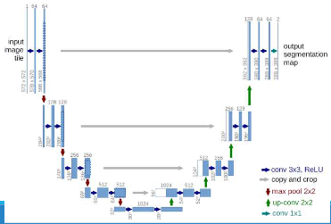
    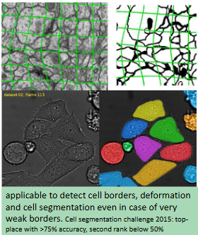

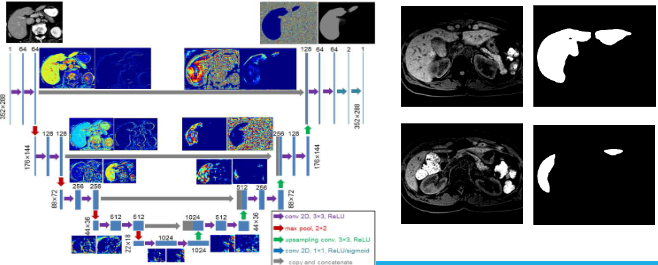

**Wie würden Sie dabei den Datenfluss mit RNNs bzw. LSTM vergleichen?**

- U-Net: Intra-sample Verbindungen -> verarbeitet räumliche Information innerhalb eines Bildes.
- RNNs/LSTMs: Inter-sample Verbindungen -> verarbeiten zeitliche Abhängigkeiten über mehrere Datenpunkte hinweg (z. B. bei Videos oder Sequenzen).
- Während U-Nets "horizontal" im Bild lernen, lernen LSTMs "vertikal" über Zeit oder Sequenzen hinweg.

**Welche Vorverarbeitungsschritte sind notwendig, bevor das Eingangssignal (z.B. Bild) dem Input-Layer übergeben werden kann?**

1. BLOB-Conversion:
- Alle Bilder müssen gleiche Größe, Farbtiefe und Wertebereich (z. B. 8-bit, 0–255) haben.
- Die Wahl der Interpolationsmethode beim Resizing (z. B. bilinear vs. nearest) hat Einfluss auf Ergebnisqualität.

2. Mean-Subtraction:
- Durchschnittswert des Bildes oder der Trainingsmenge wird abgezogen.
- Ziel: Farb- und Beleuchtungsunterschiede ausgleichen.
- Optional: Standardabweichungsskalierung zur Normalisierung über Kanäle hinweg.

3. Image Whitening (Zero Component Analysis):
- Zentriert die Daten (Mittelwert = 0),
- macht sie unkorreliert (durch Rotation),
- skaliert sie (durch Eigenwert-Normalisierung).
- Ziel: Reduktion von Redundanz und Korrelation in den Inputdaten, was das Lernen stabiler macht.

**Welche Auswirkung hat die Wahl der Vorverarbeitung auf das trainierte CNN?**
- Essentiell für die Trainingsqualität:
    - Falsche Vorverarbeitung -> schlechte Ergebnisse trotz guter Architektur.
- Gute Vorverarbeitung führt zu:
    - robusteren Modellen,
    - besserer Generalisation,
    - schnellerer und stabilerer Konvergenz.
- Spezielle Vorverarbeitung (z. B. Augmentation) kann Domänenwissen (z. B. Schnee im Wald) einfließen lassen.

---

**6.6 Nennen Sie Anwendungsgebiete für Deep Learning.**

* Allgemeine Computer Vision-Aufgaben:
    * Pose- und Aktivitätserkennung
    * Bildklassifikation, Segmentierung und Objekterkennung
* Spezifische Erkennungsaufgaben:
    * Gesichtserkennung und Emotionsklassifikation
    * Formbasierte Detektion/Klassifikation (z.B. für abstrakte Formen)
    * Personen-Detektion & -Tracking
    * Erkennung von Objekten im Kontext des autonomen Fahrens (z.B. Autos, Fahrzeuge)
    * Texterkennung (OCR)
    * Spracherkennung und natürliche Sprachverarbeitung
    * Human 3D Pose Estimation, Roboterwahrnehmung und Viewpoint Estimation unter Verwendung von 3D-Modellen
    * Klassifikation von Meta-Merkmalen wie der Anzahl von "Inseln" in Bildern
* Synthese und Generierung von Daten:
    * Bildsynthese mithilfe von GANs (Generative Adversarial Networks), z.B. für die Erzeugung von Trainingsbildern oder die Synthese von Gesichtern oder medizinischen Datensätzen.
    * Text-to-Speech-Synthese.

**Differenzieren Sie dabei zwischen Klassifikation und Segmentierung – was sind die Auswirkungen auf die Netzwerkarchitektur (input/output Layer)?**

* **Klassifikation:**
    * **Ziel:** Einer Eingabe (z.B. einem Bild) ein oder mehrere Labels (Klassen) zuordnen.
    * **Auswirkungen auf die Netzwerkarchitektur (Output Layer):** Bei der Klassifikation erzeugt die Ausgabeschicht des Convolutional Neural Networks (CNN) typischerweise nur Klassenlabels. Das bedeutet, das Netzwerk gibt eine Wahrscheinlichkeitsverteilung über vordefinierte Klassen aus (z.B. "Katze", "Hund", "Vogel").

* **Segmentierung:**
    * **Ziel:** Jedem Pixel eines Bildes eine Klasse zuweisen, um so Objekte oder Regionen exakt abzugrenzen.
    * **Auswirkungen auf die Netzwerkarchitektur (Input/Output Layer):** Für die Segmentierung wird die Bilddaten nach der Größenreduzierung wieder auf die ursprüngliche Auflösung hochskaliert, um eine finale Segmentierungsmaske zu erhalten.

**Was ist die Schwierigkeit bei der Verarbeitung von Eingangsdaten dynamischer Größe?**

Die Verarbeitung von Eingangsdaten dynamischer Größe (d.h., unterschiedlich große Bilder) stellt für viele Deep Learning-Modelle, insbesondere für Convolutional Neural Networks (CNNs), eine Herausforderung dar:

* **Feste Eingabegrößen:** CNNs sind typischerweise für eine spezifische Eingabebildgröße trainiert. Das bedeutet, dass alle Eingabebilder an diese vordefinierte Größe angepasst werden müssen, bevor sie in das Netzwerk eingespeist werden.
* **Preprocessing (BLOB-Konvertierung):** Der erste Schritt im Preprocessing für CNNs ist die BLOB-Konvertierung, bei der die Größe, die Pixeltiefe und der Skalarbereich aller Eingabebilder angepasst werden.
    * Die Wahl der Interpolationsstrategie während dieser Größenanpassung kann einen erheblichen Einfluss auf die erzielbare Ausgabequalität haben.

---

**6.7 Erläutern Sie das Prinzip von GANs und deren Einsatzgebiete.**

Generative Adversarial Networks (GANs) sind eine Art von neuronalen Netzen, die sich hervorragend zum Generieren von Daten eignen, wie zum Beispiel künstliche Musik oder künstliche Gemälde, die echten Werken ähneln. Das grundlegende Prinzip von GANs basiert auf einem **adversariellen (gegnerischen) Ansatz**, bei dem zwei neuronale Netzwerke in einem kontinuierlichen Wettstreit miteinander trainiert werden.

Diese beiden Netzwerke sind:
* Der **Generator**: Dieses Netzwerk hat die Aufgabe, eine sehr große Anzahl von Hypothesen (z.B. neue Bilder) zu generieren.
* Der **Diskriminator**: Dieses Netzwerk entscheidet, ob der vom Generator erzeugte Inhalt einem gegebenen Trainingsdatensatz ähnelt, d.h., ob er "echt" oder "gefälscht" ist.

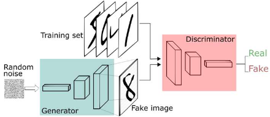

**Der Trainingsprozess:**

Der Trainingsprozess ist ein dynamisches Gleichgewicht, bei dem sich beide Netzwerke **kontinuierlich verbessern**:
* Der **Generator** wird immer besser darin, überzeugendere Daten zu erzeugen, die den "Reality Check" des Diskriminators bestehen können.
* Der **Diskriminator** wird gleichzeitig immer besser darin, "schlechten" (künstlichen) Inhalt zu erkennen.

Dieser Prozess kann auch mithilfe eines **Multi-Resolution-Ansatzes** trainiert werden, insbesondere da die GAN-Gewichte sehr empfindlich auf Änderungen reagieren. Das Training erfolgt dabei in ansteigender Auflösung, beginnend beispielsweise von 4x4 Pixeln bis zu 128x128 Pixeln und höher.

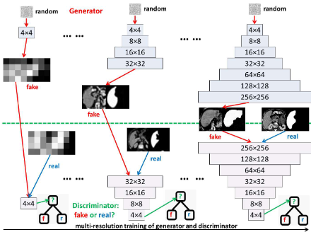

**Einsatzgebiete von GANs:**

GANs finden in einer Vielzahl von Anwendungsgebieten Einsatz, insbesondere dort, wo die Synthese und Generierung von Daten im Vordergrund steht:
* **Bildsynthese**:
    * GANs können zur **Erzeugung von Trainingsbildern** verwendet werden, was den Bedarf an großen Mengen manuell annotierter Daten reduziert.
    * Ein prominentes Beispiel ist die **Gesichtssynthese**. Hierbei können GANs auf der Basis von beispielsweise 200.000 unausgerichteten RGB-Bildern von Prominenten trainiert werden, um realistische Gesichter zu generieren.
    * Die **Synthese medizinischer Datensätze** ist ein weiteres wichtiges Anwendungsgebiet. GANs ermöglichen das Training mit CT-Schnitten zusammen mit zugehörigen Ground-Truth-Segmentierungen. Dies stellt eine ausgezeichnete Alternative dar, wenn nicht genügend Trainingsdaten vorhanden sind.
* **Text-to-Speech-Synthese**

---

**6.8 Diskutieren Sie die Bedeutung und Anwendungsgebiete von Yolo.**

**YOLO** (You Only Look Once) ist eine Architektur für die **Objektdetektion in Echtzeit**. Es wurde entwickelt, um Objekte in Bildern nicht nur zu klassifizieren, sondern auch deren genaue Position und Größe mittels **Bounding Boxes** zu lokalisieren.

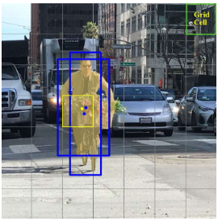

Die Kernidee von YOLO ist, dass ein Eingabebild in ein **Raster unterteilt** wird. Jede Zelle in diesem Raster ist dafür verantwortlich, ein Objekt zu detektieren. Dabei werden für jedes Rasterfeld **Begrenzungsrahmen (Bounding Boxes)** und **Objektklassen-Wahrscheinlichkeiten** erkannt. Die Begrenzungsrahmen werden dann basierend auf ihrer Konfidenz gefiltert.

Anwendungsfälle:
- Echtzeit Objektdetektion
- z.B. erkennen von Baumstämmen in einem Bild

---

**6.9 Diskutieren Sie die Bedeutung der Vorverarbeitung, wenn Bilddaten in den Eingangstensor überführt werden.**

* Vorverarbeitung ist Grundlage für plausible, robuste und präzise Ergebnisse.
* Anpassung an das CNN-Layout: Die gewählte Vorverarbeitungsstrategie muss stark vom Layout des CNNs und der Art und Weise, wie die Regionen von Interesse (ROIs) der Eingabebilder in das Netzwerk eingespeist werden, abhängen.
* **Standardisierung des Inputs (BLOB-Konvertierung):**
    * Anpassung von Größe, Pixeltiefe und Skalarbereich aller Eingabebilder.
    * Die Wahl der Interpolationsstrategie kann die erreichbare Ausgabequalität erheblich beeinflussen.
* **Farb-/Helligkeitsnormalisierung (Mittelwert-Subtraktion):**
    * Durch das Subtrahieren des Mittelwerts des Bildes wird eine normierte Skala erreicht.
    * Dies gleicht Helligkeitsänderungen in den Datensätzen aus.
    * Zusätzlich kann eine Skalierung durch die Standardabweichung angewendet werden, um gleiche Wertebereiche pro Kanal zu gewährleisten.
* **Merkmalsverstärkung (Image Whitening):**
    * Diese Methode, auch Zero Component Analysis genannt, transformiert die Daten so, dass die Kovarianzmatrix der Einheitsmatrix entspricht.
    * Dazu werden die Daten null-zentriert, entkorreliert (rotiert, bis keine Korrelation mehr besteht) und neu skaliert.

**Was könnte dabei schiefgehen?**

* **Inadäquate Strategiewahl:** Wenn eine ungeeignete Vorverarbeitungsstrategie gewählt wird, können schwache Ergebnisse die Folge sein.
* **Falsche Interpolation:** Eine schlechte Wahl der Interpolationsstrategie während der BLOB-Konvertierung kann die Ausgabequalität signifikant beeinträchtigen.
* **Mangelnde Repräsentativität des Datensatzes:** Auch umfassende Datensätze decken oft nur einen sehr kleinen Teil der realen Welt ab.
* **Qualität und Korrektheit der Referenzdaten:** Die Qualität und Korrektheit der zugrundeliegenden Referenzdatensätze (Ground Truth) wird selten selbst evaluiert. Dies kann zu Redundanzen, Lücken und Fehlern im Ground Truth führen, die einen Bias einführen.
* **Herausfordernde Bildmerkmale:** Die Algorithmen können bei Bildern mit geringem Kontrast, Schatten, Blendung, Reflexionen, verwirrenden Texturen und Okklusionen Schwierigkeiten haben.
* **Bias in Orientierungen oder Inhalten:** Ein Bias hinsichtlich bevorzugter Orientierungen (z.B. Autos immer von der Seite) oder Redundanzen im Inhalt.

---