# BVA Klausurfragen 2025

## 0.Overview [5]

**0.1 Wie kann man ein überbestimmtes Gleichungssystem lösen. Erläutern Sie die erforderlichen Schritte. Formen Sie die Gleichungen für ein konkretes BSP um, sodass via Matrix + Falk-Schema lösbar. Welche Vor- und Nachteile besitzt diese Strategie des Gleichungslösens?**


Ein überbestimmtes Gleichungssystem liegt vor, wenn die Anzahl der nicht-redundanten Gleichungen größer ist als die Anzahl der zu lösenden oder zu approximierenden Variablen. Im Allgemeinen lassen diese Gleichungssysteme keine eindeutige und exakte Lösung zu, weshalb ein Fehler pro Gleichung eingeführt wird.

Lösung eines überbestimmten Gleichungssystems:

Das Ziel bei der Lösung eines überbestimmten Gleichungssystems ist es, den Gesamtfehler als Funktion der quadrierten Differenzen zu minimieren, um die bestmögliche Annäherung an eine Lösung zu finden. Dies wird durch die Umformung in die sogenannte **Gaußsche Normalgleichung** erreicht.

**Erforderliche Schritte:**

1.  **Darstellung des Systems:** Das ursprüngliche überbestimmte Gleichungssystem wird in der Form Ax = B ausgedrückt, wobei A die Koeffizientenmatrix, x der Vektor der unbekannten Variablen und B der Ergebnisvektor ist.
2.  **Umwandlung in die Gaußsche Normalgleichung:** Um eine lösbare Form zu erhalten, multipliziert man beide Seiten der Gleichung Ax = B von links mit der Transponierten der Matrix A (Aᵀ). Dies führt zur Gaußschen Normalgleichung: **AᵀAx = Aᵀb**.
3.  **Lösung:** Die Gaußsche Normalgleichung kann dann durch verschiedene Methoden gelöst werden, unter anderem durch eine Erweiterung des **„Falk-Schemas“ der Matrixmultiplikation**. Die Lösung für x ergibt sich dann durch Multiplikation mit der Inversen von (AᵀA): **x = (AᵀA)⁻¹ * (Aᵀb)**.

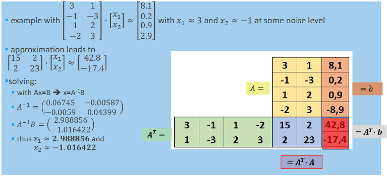

**Vorteile:**

* Diese Strategie ermöglicht die **näherungsweise Lösung von überbestimmten Gleichungssystemen**. Dies ist besonders nützlich in Anwendungsfällen wie der Registrierung oder Kamerakalibrierung, wo eine größere Anzahl von Referenzpunkten zur Stabilisierung des Ergebnisses und zur Annäherung einer Transformationsmatrix verwendet wird.

**Nachteile:**

* Ungenauigkeiten durch Gleitkommazahl-Arithmetik

---

**0.2 Geben Sie eine (eigene) Definition für Computer Vision. Welche Disziplinen sind mit welchen Konzepten/Algorithmen involviert?**

Computer Vision ist eine Erweiterung der Bildverarbeitung, die sich mit der komplexen und fortgeschrittenen Bildanalyse befasst. Ihr Ziel ist es, gewünschte Strukturen in Bildern zu erkennen oder zu segmentieren, um ein vollständiges Bild- und Szenenverständnis zu ermöglichen. Die Eingabedaten können einzelne monokulare Bilder, Videostreams, 3D-Bilder, zusätzliche Sensordaten oder 3D-Oberflächenmodelle umfassen, oft auch große Mengen visueller Daten im Sinne von Big Data.

- **Bildverarbeitung**: Filterung, Bildrekonstruktion, Farbtransformationen, einfache Segmentierungsaufgaben.
- **Optik und Bildgebungssysteme**: Kamerakalibrierung, Verzerrung, 3D-Rekonstruktion.
- **Computergrafik**: Geometrische Modellierung, Formmodelle, Reflexionen, Beleuchtungsmodelle, Testdatengenerierung, 3D-Rekonstruktion, Ergebnisdarstellung.
- **Mustererkennung**: Texturen, SIFT (Scale-Invariant Feature Transform), VSLAM (Visual Simultaneous Localization and Mapping).
- **Robotik**: VSLAM, autonomes Fahren, Produktionsinspektion.
- **Künstliche Intelligenz und Heuristiken**: Merkmalsbasierte Klassifizierung, Registrierung, symbolische Repräsentation.
- **Mathematik, Numerik**: Projektive Geometrie, Wahrscheinlichkeiten, Statistik, Signalverarbeitung.

---

**0.3 Was sind klassische Anwendungsgebiete der Computer Vision?**

- **3D-Rekonstruktion aus planaren Bildern**
- **Erkennung (Recognition)**: die verschiedene Formen annehmen kann:
    - Erkennung von Markern und Objekten.
    - Gesichtserkennung, Iris-, Fingerabdruck-, Gesten- und Handschrifterkennung.
    - Erkennung der menschlichen Körperhaltung und Aktivitäten.
    - Optische Zeichenerkennung (OCR).
- **Klassifikation/Segmentierung**: um Objekte zu identifizieren und abzugrenzen:
    - Kontursegmentierung von Objekten, um gewünschte Objekte zu extrahieren und zu charakterisieren.
    - Semantische visuelle Klassifikation ganzer Bilder.
    - Komplexere Schlussfolgerungen aus Bilddaten unter Nutzung von Künstlicher Intelligenz (KI). Hierbei wird oft eine semantische Interpretation von Bildern als Voraussetzung benötigt, beispielsweise durch:
        - **Klassifikation (Classification)**: Das gesamte Bild wird mit einem "Wort" getaggt.
        - **Objektdetektion (Object Detection)**: Zusätzlich zur Klassifikation wird der Bereich von Interesse (ROI) um das potenziell verdeckte Schlüsselobjekt erkannt, sowohl für einzelne als auch für mehrere Objekte.
        - **Instanzsegmentierung (Instance Segmentation)**: Die präzise sichtbare oder verdeckte Pixelregion, die sich auf das klassifizierte Objekt bezieht, wird markiert.
- **Navigation**: insbesondere in autonomen Systemen: Autonomes Fahren an Land, unter Wasser und im Weltraum.
- **Mixed Reality (Erweiterte Realität)**: die reale und computergenerierte Objekte verschmilzt.
- **Synthetische Bilder**: Morphing und computergenerierte Bilder (z.B. in Filmen)

---

**0.4 Welche Bildeigenschaften sind für die menschliche Wahrnehmung relevant?**

- Oberflächenfarbe
- 3D-Sehen aufgrund der Parallaxe der menschlichen Augen
- Beleuchtung/Schattierung zur Annäherung von 3D-Form und Entfernung
- Bildtextur
- Form- und Oberflächeneigenschaften
- A-priori-Wissen über gelernte Objekte, deren Größe und 3D-Struktur
- Stereotypisches Denken als "Kurzschluss" für das menschliche Erkennungssystem

---

**0.5 Skizzieren Sie Computer Vision mit den relevantesten Verfahren grob als Wissenslandkarte.**


---
## 1.Linear Imaging Systems [9]

**1.1 Rotation in 2D: welche zwei Möglichkeiten gibt es hierfür? Fertigen Sie eine Skizze an.**

**Rotation des Punkts im fixen Koordinatensystem**
- Rotation von Punkt P aktiv um den Ursprung
- Koordinatensystem bleibt unverändert
- Neue Position des Punkts P' wird mit der Rotationsmatrix berechnet
- Rotationsmatrix:
$$
R(\alpha) =
\begin{pmatrix}
\cos\alpha & -\sin\alpha \\
\sin\alpha & \cos\alpha
\end{pmatrix}
$$

- Transformation:
$$
P' = R(\alpha) \cdot P
$$

**Rotation des Koordinatensystems bei fixem Punkt**
- Statt den Punkt zu drehen, wird das gesamte Koordinatensystem in die verkehrte Richtung (-$\alpha$) rotiert

**Skizzen im Vergleich:** \
Beide führen zur gleichen neuen Position relativ zum Koordinatensystem:

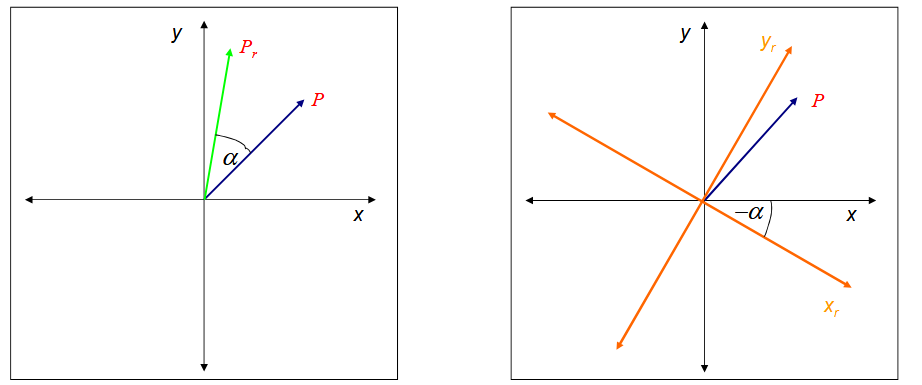

---
**1.2: Wie viele Rotationswinkel gibt es in 3D.**
Drei Rotationswinkel, auch drei Rotationsfreiheitsgrade:
- Rotation um x-Achse (Roll)
- Rotation um y-Achse (Pitch)
- Rotation um z-Achse (Yaw)

**Wie groß Matrix für Translation, Rotation, Skalierung in 3D. Warum 4x4. Wo kommt fehlende 4-te Koordinate in 3D her?**
- Translation: braucht 4×4 (nicht mit 3×3 darstellbar!)
- Rotation: 4×4 (3x3 würde reichen)
- Skalierung: 4×4 (3x3 würde reichen)

Man braucht 4x4 damit auch Translation als Matrixmultiplikations möglich ist. 4-te Koordinate kommt von der Verwendung von homogenen Koordinaten ($(x,y,z)→(x,y,z,1)$) -> erlaubt, dass alle affine Transformationen mit einer einzigen 4×4-Matrix dargestellt werden können 

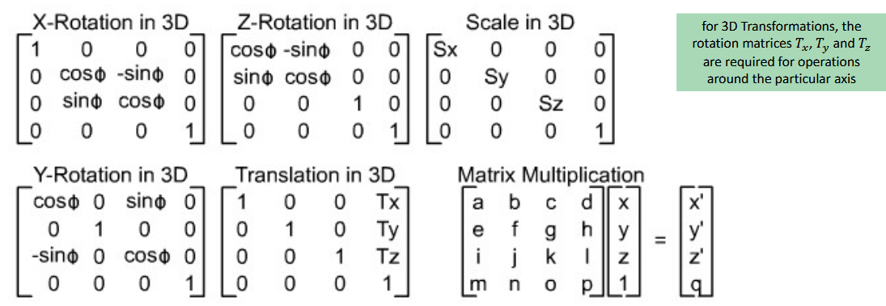

**Sind affine Transformationen kommutativ? Zeigen Sie anhand eines 2D Beispiels mit Rot/Trans, dass NICHT kommutativ.**

Nein, im Allgemeinen sind sie nicht kommutativ:

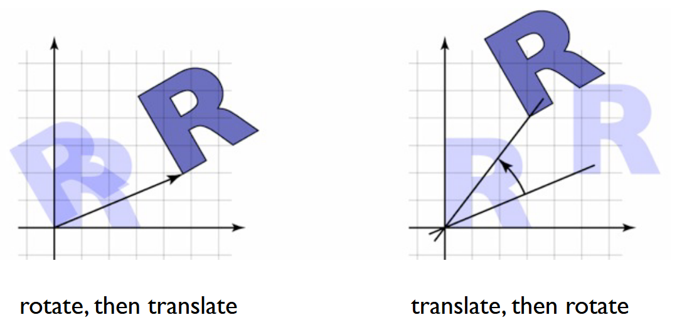

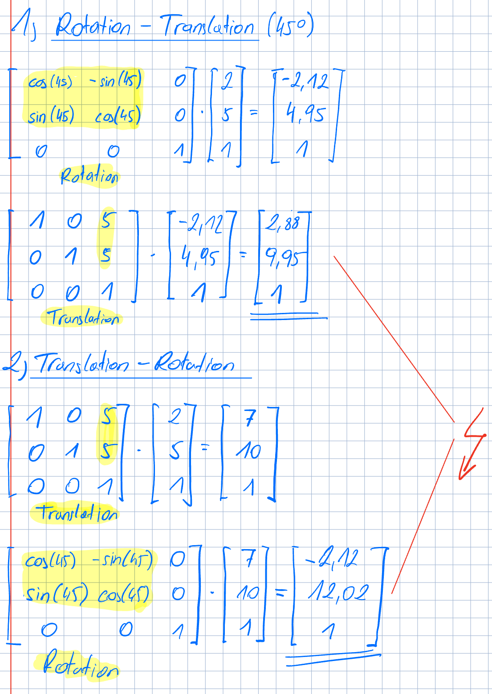

---
**1.3 Intrinsische vs. Extrinsische Rotation, d.h. Objekt- bzw. Koordinatensystem-bezogen. Vgl. Vor und Nachteile. Welche Eigenheit gibt es bei der Überführung von extrinsisch nach intrinsisch (Rot-Reihenfolge dreht sich um)**

**Intrinsische Rotation:** Das Objekt rotiert um seine eigenen Achsen, die sich bei jeder Rotation mitdrehen

**Extrinsische Rotation:** Das Objekt wird im fixen Weltkoordinatensystem gedreht. Jede Rotation erfolgt um eine globale Achse, die sich nicht mitdreht

**Eigenheit bei der Überführung:** Wenn man von extrinsisch zu intrinsisch (oder umgekehrt) übergeht, muss man die Reihenfolge der Matrixmultiplikationen umkehren.

| Merkmal     | **Extrinsisch**                           | **Intrinsisch**                                 |
| ----------- | ----------------------------------------- | ----------------------------------------------- |
| Bezug       | Weltkoordinatensystem (fixe Achsen)       | Objektachsen (rotieren mit)                     |
| Anwendung   | Kameraausrichtung, Welt-Tracking          | Robotik, Luftfahrt, Gelenk-Animation            |
| Verständnis | Mathematisch klarer                       | Visuell besser nachvollziehbar                  |
| Reihenfolge | z → y → x                                 | x → y → z                                       |
| Nachteil    | nicht intuitiv bei verketteten Rotationen | Achsen ändern sich ständig → komplexere Analyse |

---
**1.4 Was bedeutet Kamera-Kalibrierung? Wo liegen die Anwendungsgebiete und welche generellen Einschränkungen können Abbildungssystemen anhaften (distortion, keine echten Farben, usw.)**

Kamera-Kalibrierung ist der Prozess, bei dem man die inneren (intrinsischen), äußeren (extrinsischen) Parameter und optional den Verzerrungskoeffizienten einer Kamera bestimmt, um ein mathematisch korrektes Abbildungsmodell zu erhalten.

> intrinsische Parameter = Brennweite und optisches Zentrum \
> extrinsische Parameter = Rotation und Translation der Kamera zur Welt

**Anwendungsgebiete:**
- Bildvermessung, Bestimmung der Position von Objekten
- 3D-Rekonstruktion
- Tiefenbestimmung
- Forensik 

**Einschränkungen:**
- RGB-Sensoren liefern keine spektral echten Farben
- Bestimmte Tiefe wird fokussiert
- Fertigungsfehler bei Linsen

---
**1.5 Warum kommt es bei der Camera Obscura zu Unschärfe? Fertigen Sie eine Skizze an und diskutieren Sie wovon es abhängt, dass ein Bild mittels Camera Obscura vergrößert oder verkleinert wird. Konnex zu adaptiven Filtern zwecks Korrektur**
- Die Camera Obscura verwendet ein Loch (kein Linsensystem), durch das Licht auf eine Projektionsfläche fällt. Jeder Bildpunkt entsteht durch Lichtstrahlen, die von einem Punkt in der Szene durch das Loch auf der Fläche treffen.
- Ist das Loch zu groß, gelangen mehrere Lichtstrahlen von leicht unterschiedlichen Richtungen durch das Loch auf denselben Bildpunkt -> **Unschärfe**
- Größe der Öffnung:
    - kleiner → schärferes Bild, aber dunkler (weniger Licht)
    - größer → helleres, aber unschärferes Bild

- Abstand von Objekt und Projektionsfläche:
    - Größerer Abstand → größere Projektion (Bild wird vergrößert), aber auch potenziell unschärfer
    - Näher am Loch → kleineres, schärferes Bild

Skizze:

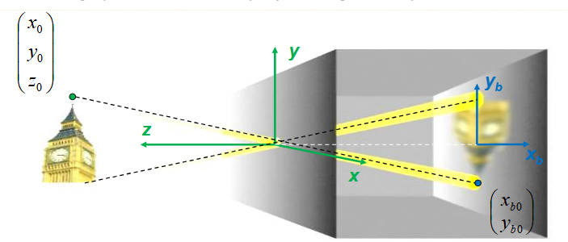

**Konnex zu adaptiven Filtern zwecks Korrektur:**
- Unschärfe kann man durch adaptive Filter bereinigen (z.B. Anisotrope Diffusion)

---
**1.6 Welche intrinsischen und extrinsischen Parameter als Matrizeninhalte sind bei der Kamera-Kalibrierung zu lösen? Beschreiben Sie jeden der Parameter. Warum gibt es 2 Parameter für die Fokuslänge (x,y)? Durch welche weiteren Parameter kann eine Verzerrungskorrektur erfolgen?**

**Instrinsische Parameter**
$$
\begin{bmatrix}
\phi_x & \gamma & \delta_x \\
0 & \phi_y & \delta_y \\
0 & 0 & 1
\end{bmatrix}
$$

- $\phi_x$ - horizontale Brennweite (Fokuslänge)
- $\phi_y$ - vertikale Brennweite (Fokuslänge)
- $\gamma$ - Scherung zwischen x- und y-Achse
- $\delta_x$ - x-Koordinate des Bildzentrums
- $\delta_y$ - y-Koordinate des Bildzentrums
- => es gibt zwei Fokuslängen, weil die physikalische Größe der Pixel in x- und y-Richtung nicht gleich sein muss.

**Extrinsische Parameter**
$$
\begin{bmatrix}
\omega_{11} & \omega_{12} & \omega_{13} & \tau_{x} \\
\omega_{21} & \omega_{22} & \omega_{23} & \tau_{y} \\
\omega_{31} & \omega_{32} & \omega_{33} & \tau_{z} \\
\end{bmatrix}
$$

- $\omega$ - 3x3 Rotationsmatrix - Orientierung der Kamera im Raum
- $\tau$ - 3x1 Translationsmatrix - Position der Kamera

**Verzerrungskorrektur**
$$
x′=x⋅(1+\beta_1​r^2+\beta_2​r^4) \\
y′=y⋅(1+\beta_1​r^2+\beta_2​r^4)
$$

- $x,y$ - ursprüngliche Koordinaten
- $x',y'$ - verzerrte Koordinaten
- $r$ - Radius
- $\beta$ - radiale Verzerrungskoeffizienten

---
**1.7 Welche grundlegenden 3 geometrischen Probleme können mittels Kamera Kalibrierung gelöst werden? Erläutern Sie ev. mit Skizze.**

- Bestimmung der extrinsischen Parameter
- Bestimmung der intrinsische Parameter

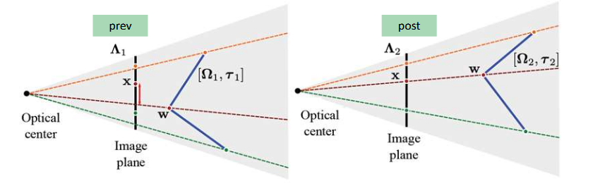

- 3D-Rekonstruktion aus mehreren Ansichten

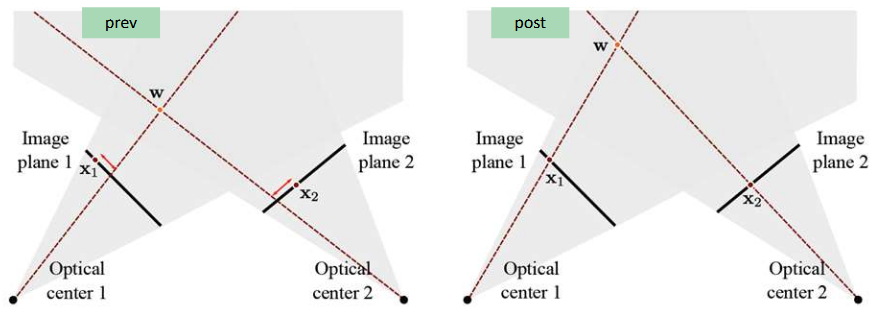

---
**1.8 Beschreiben Sie den Verfahrensablauf bei der Kalibrierung einer Kamera (Schachbrett-Muster).**
- Ziel: Bestimmung der intrinsischen und extrinsischen Kameraparameter durch Beobachtung eines bekannten 2D- oder 3D-Kalibriermusters, z.B. eines Schachbretts
1. Kalibriermuster aufnehmen
    - Schachbrettmuster mit 7×6 Gitterpunkte
    - Muster muss aus mehreren Blickwinkeln aufgenommen werden
2. Referenzpunkte definieren
    - Weil Muster 2D ist -> z = 0
    - Die Punkte werden definiert: (0,0),(1,0),... oder in echten Einheiten: (0,0),(0,50),...
3. Bildpunkte extrahieren
    - Detektion der zugehörigen Bildpunkte​ im aufgenommenen Bild
    - z.B. über automatische Checkerboard-Erkennung
4. Gleichungssystem aufstellen
    - Jedes Punktpaar liefert zwei Gleichungen
    - Es gibt insgesamt 12 Unbekannte (Parameter in der Projektionsmatrix)
    - Mindestens 6 Punktpaare sind nötig – mehr Punkte verbessern die Genauigkeit (→ Overdetermined system)
5. Optimierung der Parameter
    - Intrinsische und extrinsische Parameter werden geschätzt & optimiert
6. Verzerrungskorrektur anwenden
    - Bild kann nun entzerrt werden

---
**1.9 Erläutern sie grob, wie die Gleichungen zur Kalibrierung einer Kamera definiert und gelöst werden können. Ev. mit Skizze.**

```math
\lambda
\begin{bmatrix}
x \\
y \\
1
\end{bmatrix}
=
\begin{bmatrix}
\phi_x & \gamma & \delta_x & 0 \\
0 & \phi_y & \delta_y & 0 \\
0 & 0 & 1 & 0 \\
0 & 0 & 0 & 1
\end{bmatrix}
\cdot
\begin{bmatrix}
\omega_{11} & \omega_{12} & \omega_{13} & \tau_{x} \\
\omega_{21} & \omega_{22} & \omega_{23} & \tau_{y} \\
\omega_{31} & \omega_{32} & \omega_{33} & \tau_{z} \\
0 & 0 & 0 & 1
\end{bmatrix}
\cdot
\begin{bmatrix}
u \\
v \\
w \\
1
\end{bmatrix}
```

- $\lambda$ - Skalierungsfaktor
- $\begin{bmatrix}
    x \\
    y \\
    1
   \end{bmatrix}$ - Bildkoordinaten
- $\begin{bmatrix}
    \phi_x & \gamma & \delta_x & 0 \\
    0 & \phi_y & \delta_y & 0 \\
    0 & 0 & 1 & 0 \\
    0 & 0 & 0 & 1
   \end{bmatrix}$ - intrinsisch
- $\begin{bmatrix}
    \omega_{11} & \omega_{12} & \omega_{13} & \tau_{x} \\
    \omega_{21} & \omega_{22} & \omega_{23} & \tau_{y} \\
    \omega_{31} & \omega_{32} & \omega_{33} & \tau_{z} \\
    0 & 0 & 0 & 1
   \end{bmatrix}$ - extrinsisch
- $\begin{bmatrix}
    u \\
    v \\
    w \\
    1
  \end{bmatrix}$ - Weltkoordinaten

**Wie kann die Gleichung gelöst werden?**
- Annahme: Die intrinsischen Parameter müssen nicht berechnet werden, siehe Skizze:

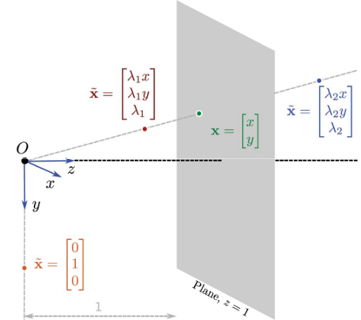

1. Für jeden Punkt im Bild werden zwei Gleichungen definiert (eine für x, eine für y)
2. Dabei haben wir 12 unbekannte Parameter (extrinsisch) => zum Lösen kann das SVD (Singular Value Decomposition) angewendet werden  

---
## 2. Segmentation and Classification [8]

**2.1 Differenzieren Sie die Begriffe Klassifikation, Segmentierung und Lokalisierung für ein BSP mit 1-N Objekten.**

**Klassifikation.**

- Definition: Bestimmung der Objektklasse ohne Ortsangabe
- Beispiel: Das System erkennt nur "CAT" (Katze) im Bild
- Ausgabe: Klassenbezeichnung (z.B. "Katze", "Hund", "Ente")
- Anwendung: Bei einem Objekt im Bild

**Klassifikation + Lokalisierung**

- Definition: Bestimmung der Objektklasse UND deren Position
- Beispiel: Das System erkennt "CAT" und umrahmt die Katze mit einem roten Bounding Box
- Ausgabe: Klassenbezeichnung + Koordinaten der Begrenzungsbox
- Anwendung: Bei einem Objekt im Bild

**Object Detection**

- Definition: Erkennung und Lokalisierung multipler Objekte
- Beispiel: Das System erkennt und lokalisiert "CAT, DOG, DUCK" mit verschiedenfarbigen Bounding Boxes
- Ausgabe: Multiple Klassenbezeichnungen + jeweilige Begrenzungsboxen
- Anwendung: Bei 1-N Objekten im Bild

**Instance Segmentation**

- Definition: Pixelgenaue Segmentierung jeder Objektinstanz
- Beispiel: Jedes Objekt (Katze, Hund, Ente) wird pixelgenau in unterschiedlichen Farben markiert
- Ausgabe: Pixelmaske für jede Objektinstanz + Klassenbezeichnung
- Anwendung: Bei 1-N Objekten mit präziser Formerfassung

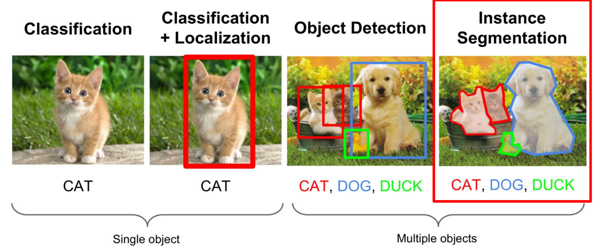

_Why tf are they so damn cute?_

Die Komplexität steigt von links nach rechts: Klassifikation → Lokalisierung → Detection → Instance Segmentation.

---

**2.2 Wie kann man mittels MeanShift eine Vorsegmentierung bewirken, wie mittels KMeans Clustering + Quantisierung/Region Labelling, wie mittels Anisotroper Diffusion + Quantisierung/Region Labelling? Vergleichen Sie und erläutern Sie kurz.**

**Mean Shift**
- Funktionsweise:
    - Pixels werden als mobile Punkte in einem 3D-RGB-Farbraum interpretiert
    - Jeder Punkt bewegt sich iterativ zum lokalen Maximum der Kernel Density Estimation (KDE)
    - Verwendet Gaussian Kernel mit spezifischem Radius zur lokalen Durchschnittsberechnung
    - Partikel konvergieren zu lokalen Clusterzentren
- Vorteile:
    - Parameter-frei (keine Vorab-Clusterzahl erforderlich)
    - Sehr robust für homogene Farbregionen
    - Kann direkt aus Histogramm berechnet werden
- Nachteile:
    - Rechenintensiv durch iterative Bewegung aller Punkte

**K-Means Clustering + Quantisierung/Region Labelling**
- Funktionsweise:
    - Clustering basiert auf Intensitäts-Ähnlichkeit
    - Iterative Neuberechnung der Clusterzentren (Centroids)
    - Pixel werden dem nächstgelegenen Centroid zugeordnet
    - Anschließend Region Labelling für räumlich zusammenhängende Bereiche
- Vorteile:
    - Einfach und schnell implementierbar
    - Gute Ergebnisse bei homogener Beleuchtung
- Nachteile:
    - Inhomogene Kontraste und Beleuchtung können zu schlechten Segmentierungen führen
    - Clusterzahl n muss vorab definiert werden
    - Region Labelling als zusätzlicher Post-Processing-Schritt erforderlich

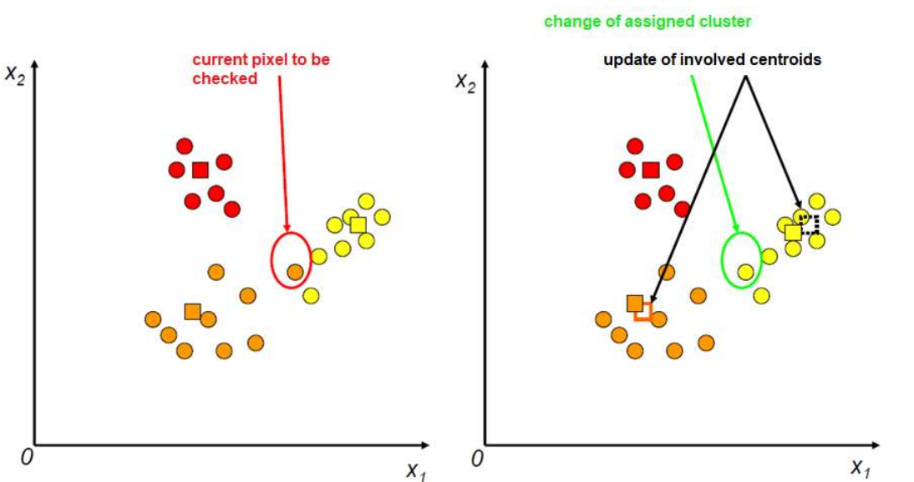

> Obwohl die Clusteranzahl bei K-Means vorab definiert wird, können nach dem Region Labelling mehr Regionen als Cluster entstehen, da nicht alle Pixel innerhalb eines Clusters örtlich zusammenhängen müssen.


**Anisotrope Diffusion + Quantisierung/Region Labelling**
- Funktionsweise:
    - Anisotrope Diffusion _(wird bei 3.1 erklärt)_ mit vielen Iterationen glättet Bereiche innerhalb von Gradientengrenzen
    - Quantisierung auf ausreichende Granularität (z.B. [0;15])
    - Region Labelling für zusammenhängende Bereiche
- Vorteile:
    - Erhält wichtige Objektgrenzen (Gradientenerhaltung)
- Nachteile:
    - Rechenintensiv durch viele Diffusionsiterationen
    - Mehrere Verarbeitungsschritte erforderlich

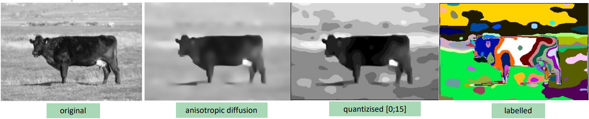


**Vergleichstabelle:**

| Kriterium | Mean Shift | K-Means | Anisotrope Diffusion |
|-----------|------------|---------|---------------------|
| **Parameter** | Parameter-frei | Clusterzahl $n$ erforderlich | Iterationszahl |
| **Geschwindigkeit** | Langsam | Schnell | Langsam |
| **Beleuchtungsrobustheit** | Gut | Schlecht | Sehr gut |
| **Post-Processing** | Nope | Region Labelling | Quantisierung + Region Labelling |

---

**2.3 Erläutern Sie kurz Graph Cut / Grab Cut. BG und FG-Wurzeln im Graph, Kantengewichte und Schnitt. Wie kann mittels Benutzerinteraktion ein verbessertes Ergebnis bewirkt werden?**

Grab Cut ist eine Weiterentwicklung von Graph Cut für die interaktive Vordergrund-/Hintergrund-Segmentierung mit minimaler Benutzerinteraktion.

**Grundprinzip:** 

- Farben von Vordergrund (FG) und Hintergrund (BG) werden als GMM (Gaussian Mixture Model) modelliert
- Jeder Pixel erhält einen α-Wert in [0;1] für die Zugehörigkeit zu BG (α=0) oder FG (α=1)
- Das GMM wird iterativ basierend auf den zugewiesenen Pixeln aktualisiert

**Graph-Struktur**
- BG und FG-Wurzeln:
    - Source: Verbunden mit garantierten Vordergrund-Pixeln
    - Sink: Verbunden mit garantierten Hintergrund-Pixeln
    - Alle Pixel sind als Knoten im Graph repräsentiert
- Kantengewichte (Energiefunktion kombiniert zwei Komponenten):
    - $E = E_{color} + E_{coherence}$
    - $E_{color}$: GMM-basierte Farbähnlichkeit
    - $E_{coherence}$: Lokale Nachbarschaft und Gradientenseparation

**Schnitt:**
- Der Graph wird so geschnitten, dass FG- und BG-Regionen getrennt werden
- Dabei werden Pixel-Verbindungen mit der höchsten "Distanz" (Gradienten, Farbunterschiede) entfernt
- Das Ergebnis minimiert die Gesamtenergie

**Iterativer Prozess:**
Das GMM wird iterativ geupdated basierend auf den neu zugewiesenen Pixeln, und der Graph-Schnitt wird neu durchgeführt bis Konvergenz erreicht ist → das Prinzip der "iterative energy minimization".

**Benutzerinteraktion für bessere Ergebnisse**

- Initiale ROI-Definition: Benutzer definiert groben Bereich um das Objekt
- Seed-Korrektur: Bei unzureichenden Ergebnissen können zusätzliche Seeds gesetzt werden:
    - FG-Seeds (Wert 255): Markierung sicherer Vordergrund-Bereiche
    - BG-Seeds (Wert 0): Markierung sicherer Hintergrund-Bereiche
- Iterative Verbesserung: Diese Seeds dienen als "Ground Truth" und verfeinern das GMM

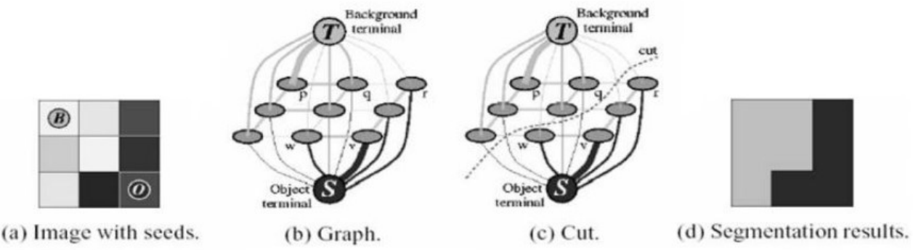

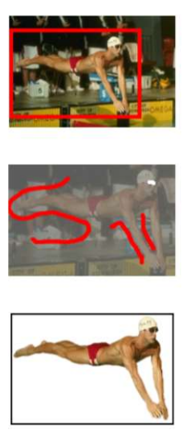

--- 

**2.4 Diskutieren Sie bei der OCR die technischen Hürden für a) die Erkennung von Text-Passagen und b) für die eigentliche Analyse der Buchstaben. Nennen Sie die dafür jeweils notwendigen verfahren.**

**Technische Hürden bei der Erkennung von Text-Passagen**

- Komplexe Bildanalyse: Text kann in verschiedenen Größen, Positionen und Orientierungen im Bild auftreten
- Variabilität: Unterschiedliche Schriftarten, Größen und Ausrichtungen erschweren die Detektion
- Hintergrund-Separation: Trennung von Text und Hintergrund bei komplexen Bildern
- Scan-Qualität: Verzerrungen, Rauschen und Unschärfe bei gescannten Dokumenten

**dazugehörige Verfahren:**

- EAST (Efficient and Accurate Scene Text Detector)
    - Nutzt rekurrente neuronale Netzwerke
    - Erstellt eine Pixel-Score-Map für lokale Zeichen-Wahrscheinlichkeit
    - Gruppiert wahrscheinliche Zeichen-Pixel zu rechteckigen Bereichen

- Region Labelling Strategien
    - Identifikation zusammenhängender Textbereiche
    - Segmentierung in einzelne Textzeilen

- "Fire-through" Methode
    - Bei nicht überlappenden Zeilen anwendbar
    - Horizontale/vertikale Projektion zur Zeilentrennung

**Technische Hürden bei der Buchstaben-Analyse**

- Ähnliche Buchstaben: Schwierige Unterscheidung zwischen ähnlichen Zeichen (z.B. "b" und "d")
- Qualitätsverluste: Sensor-Rauschen, Unschärfe, Beleuchtungsunterschiede
- Verzerrungen: Affine Transformationen durch schräge Aufnahmen
- Diskretisierung: Anti-Aliasing-Effekte bei der Digitalisierung

**dazugehörige Verfahren:**

- Merkmals-Extraktion
    - Geometrische Features: Anzahl Pixel, Breite/Höhe, Zentroid-Abstände
    - Topologische Features: Anzahl Inseln, Verzweigungspunkte
    - Korrelationskoeffizient-Berechnung für Ähnlichkeitsvergleich

- Machine Learning Ansätze
    - SVM (Support Vector Machines)
    - Neuronale Netzwerke
    - Deep Learning mit RNNs (besonders LSTM für Kontextanalyse)

- Moderne Deep Learning Architekturen
    - Convolutional Layers: Für Vorverarbeitung und Feature-Extraktion
    - Auxiliary Stage: Mehrere Schichten für Vektorverarbeitung
    - Recurrent Stage: GRU-Layer (ähnlich LSTM) für variable Eingabelängen

- Qualitätsverbesserung
    - Sprachmodelle: Plausibilitätsprüfung durch bekannte Wörter
    - Kontext-Analyse: Berücksichtigung vorheriger/nachfolgender Buchstaben
    - Template-Matching: Bei bekannten Schriftarten

--- 

**2.5 Nennen Sie einige relevante Features aus dem Bereich Textur, Geometrie und Transformation. Welche dieser Features können auch im Bereich OCR zur Analyse von binären Buchstaben innerhalb einer region of interest (ROI) verwendet werden? Inwieweit beinhalten klassische Segmentierungsverfahren wie Interval-Threshold oder Region-Growing ebenfalls Features?**

**Allgemein**

- Textur-Features
    - LBP (Local Binary Patterns): Lokale Nachbarschaftsanalyse in 3x3 Blöcken
    - Haar-Features: Verschiedene Konvolutionskerne zur Detektion spezifischer Charakteristika
- Geometrie-Features
    - F₁: Anzahl der Pixel
    - F₂: Ausdehnung in x-Richtung (max. Breite)
    - F₃: Ausdehnung in y-Richtung (max. Höhe)
    - F₄: Durchschnittlicher Abstand vom Zentroid
    - F₅: Minimaler Abstand vom Zentroid
    - F₆: Maximaler Abstand vom Zentroid
    - F₇: Zirkularität
    - F₈: Relative x-Position des Zentroids in der Bounding Box
    - F₉: Relative y-Position des Zentroids in der Bounding Box
- Transformation-Features
    - Affine Transformationen: Rotation, Skalierung, Translation
    - Delaunay-Triangulation: Bei Gesichtserkennung für invariante Topographie

**Features für OCR-Buchstaben-Analyse**

- Alle oben genannten F₁-F₉
- Anzahl der Inseln
- Anzahl der Verzweigungspunkte
- Mittlere Richtungsänderung

**Features in klassischen Segmentierungsverfahren**

Klassische Segmentierungsverfahren beinhalten Features nur in sehr geringem Umfang:
- **Interval-Thresholding:**
    - Nutzt Intensitätswerte als Feature
    - Segmentiert basierend auf Schwellenwerten (z.B. Grauwert-Histogramm)
- **Region-Growing:**
    - Basiert ebenfalls primär auf Intensitätswerten (Tmin, Tmax)
    - Zusätzlich: räumliche Nachbarschaftsinformation
    - Implizite geometrische Komponente

--- 

**2.6 Erläutern Sie das Vorgehen, wenn man OCR „von 0 weg“ eigenständig umsetzen möchte auf Basis von vorsegmentierten Regionen und Featureanalyse für die Klassifikation (vgl. Übung).**

1. Bildvorverarbeitung und Binarisierung 
    - mit Intervall-Thresholding
2. Textsegmentierung
    - "Fire-Through" Methode: Horizontale Analyse des gesamten Bildes
    - Erkennung von Textzeilen durch Detektion von Zeilen mit Vordergrundpixeln
3. Zeichentrennung
    - Vertikale "Fire-Through" Technik innerhalb jeder erkannten Zeile
    - Suche nach leeren Spalten zwischen Zeichen als Trennpunkte
4. (Optional) Zeichenregion-Optimierung (Region Shrinking)
    - Anpassung der Bounding Box auf die tatsächlichen Zeichengrenzen
    - Vorteil: Genauere Feature-Berechnung, bessere Aspekt-Verhältnisse
5.  Feature-Extraktion
    - Berechnung von Durchschnittswerten über alle Zeichenregionen
6.  Referenzzeichen-Auswahl
    - Feature-Vektor des ausgewählten Zeichens wird als Referenz verwendet
7. Vergleichsprozess
    - Vergleich der extrahierten Features mit dem Referenzzeichen
    - Berechnung des Korrelationskoeffizienten zwischen den Vektoren
    - Schwellwert-basierte Entscheidung (z.B. 0.999 für hohe Genauigkeit)
8. Ergebnisvisualisierung
---

**2.7 Was sind Haar Cascades? Wie werden sie trainiert und angewandt? Inwieweit ist das Konzept skalierungsinvariant? Führen Sie über die Bedeutung der Haar Cascade im Bereich der _??? (Hier hat Gerald ein kleines Schlagerl gehabt)_**

Haar Cascades sind ein mehrstufiges Klassifikationssystem für die Gesichtserkennung. Das System nutzt Haar-ähnliche Features (spezielle Convolution-Kernel) zur Erkennung charakteristischer Gesichtsmerkmale wie Augen, Nase und Mund. Haar-ähnliche Features sind spezielle rechteckige Convolution-Kernel (Filter), die Helligkeitsunterschiede zwischen benachbarten Bildregionen detektieren - beispielsweise dunkle Augenbereiche neben helleren Wangenbereichen oder der dunkle Bereich zwischen den Augen.

**Training von Haar Cascades:**
Trainingsdaten:
- Positive Beispiele: Viele Trainingsbilder mit Gesichtern
- Negative Beispiele: Bilder mit verschiedenen anderen Objekten (ohne Gesichter)

Trainingsverfahren:
1. Haar Features: Verschiedene Haar-Kernel werden in unterschiedlichen Maßstäben, Orientierungen und Positionen innerhalb der Bild-ROIs angewendet
2. AdaBoost-Algorithmus: Wird verwendet, um die wichtigsten Features zu identifizieren und eine Cascade-Struktur aufzubauen
3. Feature-Auswahl: Das System prüft zuerst die signifikantesten Features und evaluiert weitere nur dann, wenn ein Gesicht noch wahrscheinlich ist

**Anwendung**

Sliding Window Ansatz
- Das gesamte Bild wird in Sub-Image ROIs aufgeteilt (Sliding Windows verschiedener Größen)
- Filter-Pyramide für verschiedene Skalierungen

Cascade-Verarbeitung
- Mehrstufige Klassifikation: Nur wenn Features einen vordefinierten Schwellenwert erreichen, wird der Prozess fortgesetzt/verfeinert
- Effizienzsteigerung: Reduziert den Rechenaufwand erheblich, da nicht alle Features für jeden Bildbereich berechnet werden müssen

Non-Maximum Suppression
- Mehrere überlappende Gesichtskandidaten werden zu einem finalen Ergebnis zusammengefasst

**Skalierungsinvarianz**

Das Haar Cascade-Konzept ist skalierungsinvariant durch:
1. Filter-Pyramide: Anwendung der Haar Features in verschiedenen Maßstäben
2. Multi-Scale Detection: Das System kann Gesichter in unterschiedlichen Größen erkennen
3. Skalierbare Kernel: Die Haar Features werden in verschiedenen Größen angewendet

**Bedeutung der Haar Cascade**

_(Achtung Antworten nur geschätzt, weil Frage unvollständig -> immer dieser Gerald 🙂‍↔️)_

+ Vorteile:
    - Hohe Genauigkeit und niedrige False-Positive-Rate
    - Robuste Erkennung unter verschiedenen Bedingungen
    - Etablierter Standard in der Computer Vision

\- Nachteile:
    - Langsamer als LBP (local Binary Patterns)
    - Weniger robust gegen Verdeckungen
    - Weniger genau bei dunklen Gesichtern


> Haar Cascades waren wegweisend für die automatische Gesichtserkennung und bildeten lange Zeit den Goldstandard für Echtzeit-Gesichtsdetektion. Sie sind bis heute in OpenCV implementiert und werden als Referenz für Vergleiche mit modernen Deep Learning-Ansätzen verwendet.
> Obwohl moderne Deep Learning-Methoden heute bessere Ergebnisse erzielen, bleiben Haar Cascades ein wichtiges Grundlagenkonzept.
---

**2.8. Nennen und Diskutieren Sie alternative Ansätze zur Gesichtserkennung (historische Verfahren bis hin zu aktuellen Strategien) und charakterisieren Sie dabei jeweils die Vor- und Nachteile.**

**Historische Verfahren**
1. Geometrische Merkmale (Kanade 1973, Brunelli & Poggio 1992)

Ansatz:
- 16 Landmarken und 40 Features (Kanade) bzw. 22 Landmarken (Brunelli & Poggio)
- Berechnung von Winkeln und Seitenverhältnissen zwischen Merkmalen
- Vergleich über euklidische Distanz

Vorteile:
- Robust bei variierender Beleuchtung und kleinen Gesichtsausdrucksänderungen

Nachteile:
- Automatische Landmarken-Detektion schwierig und instabil
- Nur 75% Erkennungsrate bei 20 Personen
- Zu wenige Informationen für robuste Diskriminierung

**Traditionelle Computer Vision**
2. Haar Cascade (Viola & Jones 2001)

Ansatz:
- Haar-Features verschiedener Größe, Orientierung und Position
- AdaBoost-Algorithmus mit mehrstufiger Klassifikation (Cascade)

Vorteile:
- Hohe Erkennungsgenauigkeit
- Niedrige Falsch-Positiv-Rate

Nachteile:
- Rechnerisch komplex und langsam
- Längere Trainingszeit
- Weniger genau bei dunklen Gesichtern
- Eingeschränkt bei schwierigen Beleuchtungsbedingungen
- Weniger robust gegen Verdeckungen

3. Local Binary Patterns (LBP) (Ahonen et al. 2006)

Ansatz:
- Analyse lokaler 3x3 Pixelblöcke
- Encoding in Histogramme mit 203-bin Vektor

Vorteile:
- Rechnerisch einfach und schnell
- Kürzere Trainingszeit
- Robust gegenüber lokalen Beleuchtungsänderungen
- Robust gegen Verdeckungen

Nachteile:
- Geringere Genauigkeit
- Höhere Falsch-Positiv-Rate

4. Active Appearance Models (Edwards et al. 1998)

Ansatz:
- Statistische Form- und Texturmodelle
- Harmonisierung von Gesichtsausdrücken vor Vergleich

Vorteile:
- Berücksichtigt verschiedene Gesichtsausdrücke
- Vergleich von Form und Textur

**Aktuelle Deep Learning Ansätze**
5. Deep Learning (FaceNet - Schroff et al. 2015)

Ansatz:
- 22-schichtiges Netzwerk mit 140+ Millionen Parametern
- 128-dimensionale L2-normalisierte Repräsentation
- Training mit LFW Dataset (Millionen von Bildern)

Vorteile:
- 88% Erkennungsrate (Einzelbilder)
- 95% bei Videosequenzen (erste 100 Frames)
- Automatische Merkmalsextraktion

Nachteile:
- Hoher Rechenaufwand
- Große Trainingsmengen erforderlich

>Entwicklungstrend: Von 75% (Kanade) zu 96-98% Erkennungsrate bei modernen Ansätzen, mit Trend von manuell definierten zu automatisch gelernten Merkmalen.

 
---
## 3. Image Restauration [5]

**3.1 Erläutern Sie die Idee der Anisotropen Diffusion mit eigenen Worten. Was bedeutet die lokale Diffusionszahl ? Was bedeutet K? Wird c für jedes Pixel individuell berechnet?  Wird K für jedes Pixel individuell berechnet?  Wie viele Gradientenrichtungen sind für jedes Pixel zu betrachten?**

Anisotrope Diffusion ist ein iteratives Verfahren zur Bildrestauration, das auf einem physikalischen Modell basiert. Die Grundidee ist, dass Pixel wie Partikel behandelt werden, die ihre Intensitätswerte über die Zeit austauschen - ähnlich wie bei der Wärmediffusion.

>Entscheidend ist jedoch, dass dieser Austausch **nicht** gleichmäßig in alle Richtungen erfolgt (daher "anisotrop"), sondern durch Kanten und Gradienten im Bild gehemmt wird.

Das Ziel ist es, homogene Bildbereiche zu glätten (Rauschreduktion), während wichtige Strukturen wie Kanten erhalten bleiben.

Die lokale Diffusionszahl $c(x,y)$ steuert, wie stark die Diffusion an jedem Bildpunkt stattfindet:

- $c = 1$: Ungehemmte isotrope Diffusion (wie bei einem normalem Tiefpass-Filter)
- $c < 1$: Reduzierte Diffusion an Kanten und Gradienten

Die Konstante $K$ ist ein globaler Parameter, der die Empfindlichkeit des Filters steuert:

- $K$ bestimmt den Schwellwert, ab welcher Gradientenstärke die Diffusion gehemmt wird
- Kleine $K$-Werte: Bereits schwache Gradienten hemmen die Diffusion → starke Kantenerhaltung
- Große $K$-Werte: Nur starke Gradienten hemmen die Diffusion → mehr Glättung

Individuelle Berechnung pro Pixel:

- $c(x,y)$ wird für **jedes** Pixel individuell berechnet, basierend auf dem lokalen Gradienten an dieser Position
- $K$ wird **nicht** für jedes Pixel individuell berechnet - es ist ein globaler Parameter, der für das gesamte Bild konstant bleibt

Anzahl der Gradientenrichtungen:

- 4 Hauptrichtungen: Nord, Süd, Ost, West (Distanz = $1$)
- 4 Diagonalrichtungen: Nordost, Nordwest, Südost, Südwest (Distanz = $\sqrt{2}$)

Algorithmus-Ablauf in Prosa:

1. Filterkernel für 8 Richtungen (Nord, Nordwest, etc.) werden definiert
2. Hauptschleife (für jede Iteration):
    1. **Gradientenberechnung**: Das Bild wird mit allen 8 Richtungskerneln gefaltet → 8 Gradientenbilder
    2. **Diffusionskoeffizienten**: Für jedes Pixel und jede Richtung wird $c = e^{-(gradient/K)²}$ berechnet
    3. **Bildupdate**: Jeder Pixelwert wird um den gewichteten Durchschnitt aller 8 Richtungen ergänzt
3. Ergebnis: Geglättetes Bild mit erhaltenen Kanten.

---

**3.2 Was bedeutet „image degradation“. Filterung im Ortsraum vs. Frequenzraum. Sehen Frequenz-Spektren von natürlichen Bildern ähnlich aus? Wie kann man das nun zur Beseitigung von Störsignalen nützen? Warum muss bei der „deconvolution“ im Falle von Rauschen der hohe Frequenzbereich abgeschwächt werden (Skizze).**

Image degradation bezeichnet die Verschlechterung der Bildqualität durch verschiedene Faktoren:
- Motion blur (Bewegungsunschärfe)
- Optische Unschärfe durch Linsen
- Niedrige Auflösung
- Räumliche Quantisierung (diskrete Pixel, Partial Volume Effect)
- Additives Rauschen verschiedener Art

Die mathematische Modellierung ist simpel: $g(x,y) = f(x,y) * h(x,y) + n(x,y)$
$f$ ... ursprüngliches Bild
$h$ ... Degradationskernel
$n$ ... Rauschen
$g$ ... degradiertes Bild

Filterung im Ortsraum vs. Frequenzraum:

- Ortsraum (Spatial Domain):
    - Degradation durch Faltung mit einem Kernel: $g(x,y) = f(x,y) * h(x,y)$
    - Direkte Pixelmanipulation
- Frequenzraum (Frequency Domain):
    - Faltung im Ortsraum entspricht Multiplikation im Frequenzraum: $G(u,v) = F(u,v) \cdot H(u,v)$
    - Transformation via FFT erforderlich und wieder zurück mit IFFT

Natürliche Bilder zeigen ähnliche Spektren im Frequenzbereich
- Hohe Amplituden bei niedrigen Frequenzen
- Niedrige Amplituden bei hohen Frequenzen
- Diese Eigenschaft kann zur Approximation der Degradationsmodelle genutzt werden

Die oben genannten Erkenntnisse kann man zur Beseitigung von Störsignalen nutzen:

- Modellierung der Degradation durch bekannte Kernel (z.B. Gauss für optische Unschärfe, Sinc für Motion Blur)
- Dekonvolution zur Wiederherstellung: $F̂(u,v) = G(u,v)/H(u,v)$
- Wiener-Filter für rauschbehaftete Bilder
- Richardson-Lucy Dekonvolution für iterative Verbesserung

Warum muss bei der „deconvolution“ im Falle von Rauschen der hohe Frequenzbereich abgeschwächt werden (Skizze).

$F̂(u,v) = G(u,v)/H(u,v)$
Mathematische Ursache:

- Degradationsfunktionen $H(u,v)$ haben Tiefpass-Charakter
- $H(u,v)$ wird bei hohen Frequenzen sehr klein oder null
- Division durch sehr kleine Werte verstärkt das Rauschen extrem
- $N(u,v)$ ist das additive Rauschspektrum

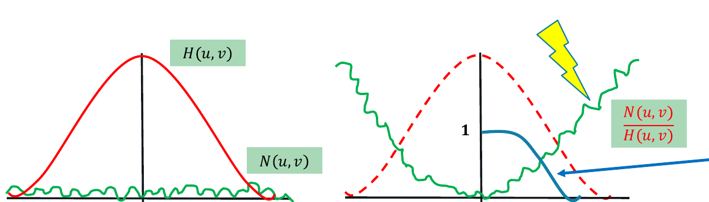

- X-Achse ist die Frequenz ($H(u,v)$ hat Tiefpass-Charakter)
- Y-Achse ist Amplitude/Verstärkungsfaktor
- Grün ist das Rauschen
- Die blaue Linie kennzeichnet das Einführen einer Dämpfungsfunktion,
z.Bsp. Butterworth Dampening

Praktische Konsequenz:
Ohne Abschwächung wird das rekonstruierte Bild völlig verrauscht, da das Rauschen bei hohen Frequenzen extrem verstärkt wird. 


---

**3.3 Die Wiener-Deconvolution kann mittels Wiener-Filterkern erfolgen, wobei K welche Bedeutung zukommt? ( Abschätzung des Signal-Rausch-Verhältnis). Wie kommt man zu K? Wie vereinfacht sich die Wiener-Deconvolution, wenn kein Rauschen im Bild vorhanden ist.**

$K$ repräsentiert eine **empirische** Konstante zur Abschätzung des Signal-Rausch-Verhältnisses. 

$K$ ermittelt man durch:
- Empirische Schätzung: $K$ wird durch Erfahrungswerte und Experimente geschätzt
- A-priori Spezifikation: Der Wert muss vorab festgelegt werden basierend auf:
    - Erwarteter Rauschstärke im Bild
    - Charakteristika des Signals
    - Empirischen Tests mit ähnlichen Bilddaten

Wenn **kein** Rauschen im Bild vorhanden ist, gilt K → 0, und die Wiener-Deconvolution vereinfacht sich zur gewöhnlichen inversen Filterung.

$F`(u,v)=\frac{F(u,v)}{H'(u,v)}$

$F'$ ... Rekonstruiertes Bild (im Frequenzbereich)
$H'$ ... Geschätzter Degradationskernel (im Frequenzbereich)
$F$ ...​ Ursprüngliches Bild (im Frequenzbereich)

---

**3.4 Muss bei der Richardson-Lucy-Deconvolution der Faltungskernel bekannt sein, der das Störsignal verursacht? Erläutern Sie in eigenen Konzepten grob, wie mittels RLD ein verzerrtes Bild wieder rekonstruiert werden kann.**

Der Faltungskernel (PSF - Point Spread Function) $h$ muss bei der Richardson-Lucy-Deconvolution bekannt sein.

Die RLD rekonstruiert verzerrte Bilder durch einen iterativen Maximum-Likelihood-Algorithmus:

Grundprinzip:

- **Ausgangspunkt**: Das verzerrte Bild $g$ und der bekannte PSF-Kernel $h$
- **Ziel**: Rekonstruktion des ursprünglichen Bildes $f$ aus der Beziehung $g = f * h$

1. Startwert: Erste Schätzung $g^0$ (z.B. das beobachtete Bild oder ein Bild mit durchschnittlichem Grauwert (z.Bsp.: $127$))
2. Iteration:
    - Berechnung eines Zwischenbildes $c^t$ durch Faltung der aktuellen Schätzung mit dem PSF: $c^t = h * g^t$
    - Pixelweise Berechnung von Korrekturkoeffizienten durch Vergleich mit dem beobachteten Bild: $m^{t(i,j)} = f(i,j)/c^{t(i,j)}$
    - Aktualisierung der Schätzung: $g^{(t+1)} = g^t · (m^t * h)$, wobei die Korrekturkoeffizienten mit dem PSF gefaltet werden
3. Abbruch: Der Algorithmus stoppt bei Konvergenz zu einer stabilen Lösung d.h. wenn sich die Korrekturkoeffizienten dem Wert 1.0 nähern

Daher ist das rechtzeitige Stoppen bei Konvergenz entscheidend für optimale Ergebnisse, da bei Über-Iterierung Artefakte entstehen können und somit die Ergebnisqualität leidet.

FunFact: Die RLD ist besonders effektiv bei Anwendungen wo die PSF gut charakterisiert werden kann, z.Bsp. Astronomie.

---

**3.5 Was bedeutet Image Superresolution? Nennen Sie unterschiedliche Strategien und erläutern Sie das Grundprinzip sehr vereinfacht mit eigenen Worten. Wo liegen die Grenzen der Image Superresolution?**

Image Superresolution bezeichnet Verfahren zur Erhöhung der Auflösung von Bildern - das heißt, aus einem niedrig aufgelösten Bild wird ein höher aufgelöstes Bild erzeugt, das mehr Details und schärfere Strukturen enthält.

Zwei Hauptkategorien:

- Klassische Computer Vision Ansätze:
    - Bi-kubische Interpolation: Einfache mathematische Vergrößerung
    - MAP (Maximum A-Posteriori): Kombination mehrerer leicht versetzter Bilder einer Szene
    - Bayes-Inferenz: Statistische Rekonstruktionsverfahren
    - SRCNN (Super-Resolution Convolutional Neural Network)
    - FSRCNN (Fast Super-Resolution CNN)
    - SRGAN (Super-Resolution Generative Adversarial Network)
    - RCAN (Residual Channel Attention Network)

Grundprinzip **sehr** vereinfacht erklärt:

- Klassische Ansätze: Nutzen mathematische Interpolation oder kombinieren mehrere Bilder derselben Szene aus leicht unterschiedlichen Blickwinkeln, um fehlende Pixelinformationen zu "erraten".

- Deep Learning Ansätze: Neuronale Netze werden mit tausenden von Bildpaaren (niedrig-/hochaufgelöst) trainiert und lernen dabei, typische Muster und Strukturen zu erkennen. Bei neuen Bildern können sie dann "intelligente Vermutungen" über fehlende Details anstellen.


Grenzen der Image Superresolution:

- Informationsgrenzen: Man kann keine Informationen erzeugen, die ursprünglich nicht vorhanden waren - nur intelligente Schätzungen basierend auf gelernten Mustern
- Anwendungsabhängigkeit: Erfolg hängt stark vom Bildinhalt ab (Text, Gesichter, unbekannte Objekte)
- Qualitätsverschlechterung: Bei zu vielen Iterationen oder zu hohen Vergrößerungsfaktoren können Artefakte entstehen
- Training-Bias: Deep Learning Modelle funktionieren am besten bei Bildinhalten, die ihren Trainingsdaten ähneln
- Physikalische Grenzen: Das Nyquist-Shannon-Abtasttheorem setzt fundamentale Grenzen für die rekonstruierbare Information

> Das Nyquist-Shannon-Abtasttheorem besagt, dass man ein Signal nur dann vollständig rekonstruieren kann, wenn man es mit mindestens der doppelten Frequenz seiner höchsten enthaltenen Frequenzkomponente abtastet - das heißt, wenn wichtige Details im ursprünglichen Bild zu fein waren und nicht erfasst wurden, können sie auch nicht mehr rekonstruiert werden.

---
## 4. Localization [10]

**4.1 Erörtern Sie die Kernidee von VSLAM anhand einer eigenen Skizze und führen Sie in diesem Zusammenhang über die loop closure aus. In welchen Anwendungsdomänen spielt der VSLAM Algorithmus eine zentrale Rolle?**

Visual SLAM verwendet hauptsächlich visuelle Informationen, also Kameradaten, zur simultanen Lokalisierung und Kartierung. Kameras erfassen visuelle Merkmale der Umgebung, und der Algorithmus berechnet daraus die Position des Geräts.

- Ziel: Lokalisierung des Roboters und simultane Erstellung einer Karte der Umgebung.
- Input: Visuelle Sensordaten (monokular/stereo), oft kombiniert mit interner Odometrie.
- Herausforderung: Henne-Ei-Problem — Für die Lokalisierung wird eine Karte benötigt; für die Kartierung wird eine präzise Lokalisierung vorausgesetzt.

**Ablauf und Konzept**
<p float="center">
    
    
</p>

1. Start: Roboter beginnt bei Pose (0,0); Umgebung ist unbekannt.
2. Bewegung gemäß interner Odometrie (Positionsschätzung), erste Unsicherheiten entstehen.
3. Beobachtung erster Merkmale (z.B. durch SIFT); Position dieser Features ist nur ungenau bekannt.
4. Weitere Bewegung: Fehler in Pose-Schätzung akkumulieren.
5. **Loop Closure:** Ein zuvor gesehenes Merkmal wird erneut erkannt. Dies erlaubt Korrektur von Pfad und Karte durch Optimierung.
    - Führt zu signifikanter Reduktion kumulierter Fehler.
    - Erhöht Vertrauen in die Lokalisierung und die Kartengenauigkeit.
    - Ist entscheidend für globale Konsistenz der Karte.


**Anwendungsdomänen von VSLAM**
- Autonome Fahrzeuge – Navigation ohne GPS, z.B. in Tunneln oder Städten.
- Rettungsroboter – Kartierung unbekannter Gebiete (z.B. Höhlen, eingestürzte Gebäude).
- Haushaltsroboter – Staubsauger, Rasenmäher: systematische Umgebungserfassung.
- Augmented Reality / Virtual Reality – Echtzeitlokalisierung von mobilen Kameras.
- Drohnen / UAVs – Umgebungserkennung für autonome Flugnavigation.

---

**4.2 Hough-Transformation von Linien (konventionelle Geradengleichung – keine Polarkoordinaten): Linie im Ortsraum wird zu Punkt im Parameterraum. Geradengleichung + Skizze. Wie kann nun damit eine Linie als lokales Max. im Parameterraum detektiert werden (Skizze)**

Ein Punkt im Ortsraum $(x_0, y_0)$ entspricht einer Geraden im Parameterraum $(m, b)$, gemäß:

  $$
  b = -x_0 \cdot m + y_0
  $$

* Für jedes Pixel im Bild (Ortsraum) wird diese Gleichung genutzt, um alle möglichen Geraden zu berechnen, die durch diesen Punkt verlaufen könnten -> **je ein Linienzug im Parameterraum**.

* **Im Parameterraum**:
  * Wenn sich viele dieser Linien in einem Punkt schneiden, bedeutet das, dass mehrere Pixel im Bild auf derselben Linie im Ortsraum liegen.
  * Der Schnittpunkt ist ein lokales Maximum im Akkumulator, das eine detektierte Linie repräsentiert.

<p float="center">
    
</p>

---

**4.3 Welche Parameter sind bei der Darstellung von Kreisen im Parameterraum sinnvoll.**

Ein Kreis im Ortsraum wird durch folgende Parameter beschrieben:
* $a, b$: Mittelpunkt des Kreises
* $r$: Radius


**Wie manifestiert sich ein Punkt dabei im Parameterraum?**

Punkt im Ortsraum -> Kreis im Parameterraum:

* Ein einzelner Bildpunkt $(x_0, y_0)$ könnte auf vielen möglichen Kreisen liegen.
* Für jeden möglichen Radius $r$ ergibt sich eine Kreislinie im Parameterraum (a, b), auf der der Mittelpunkt (des Kreises aus dem Ortsraum) liegen müsste.
* Das heißt: **Ein Punkt im Ortsraum wird zu einer Kreislinie im Parameterraum**.

**Wie sind dadurch Kreise zu detektieren? Ev. BSP**

* Für viele Punkte im Bild (z. B. Kantenpunkte): Berechne alle möglichen Kreismittelpunkte für feste Radien.
* Im **dreidimensionalen Parameterraum $(a, b, r)$**:

  * Viele Punkte erzeugen viele Kreislinien.
  * Wo sich viele dieser Linien schneiden, liegt ein lokales Maximum -> ein echter Kreis ist erkannt.

<p float="center">
    
</p>

---

**4.4 Warum wird die Generalized Hough Transformation benötigt?**

Die normale Hough-Transformation funktioniert nur bei einfachen Formen (Linien, Kreise). Für beliebige Formen (z. B. komplizierte Konturen) braucht man die generalizierte Hough Transformation.

**Wie wird die R-Tabelle errechnet? Hat die R-Tabelle die Bedeutung eines „Form-Modelles“?**

* Ein **Referenzpunkt** $P_c = (X_c, Y_c)$ wird gewählt (z. B. Mittelpunkt).
* Für jeden **Konturpunkt** $P_i = (X_i, Y_i)$:

  * Berechne den Abstand $r_i$ zum Referenzpunkt.
  * Bestimme die Kantenrichtung $\phi$ (z. B. mit Sobel-Operator).
  * Berechne den Winkel $\alpha_i$ zwischen $P_i$ und $P_c$.
* Die Werte $(r_i, \alpha_i)$ werden in der R-Tabelle nach Winkel $\phi$ sortiert gespeichert.

Ja, die R-Tabelle ist das Modell der Form.

<p float="center">
    
    
</p>


**Erhöht sich die Genauigkeit des Modells, wenn mehr Punkte entlang der Kontur in die R-Tabelle verspeichert werden?**

Ja, mehr Punkte in der R-Tabelle = genaueres Modell.


**Was ist die Bedeutung vom Index phi und wie kann man die lokale Steigung der Kontur berechnen.**

φ ist der Winkel der Kante am Konturpunkt (lokale Richtung), berechnet aus dem **Gradienten** ($g_x, g_y$). Damit sucht man passende Vektoren in der R-Tabelle.


**Wie berechnet man die lokale Steigung der Kontur?**
Mit den **x- und y-Gradienten**, z. B. aus dem **Sobel-Filter**:

$$
\phi = \arctan\left(\frac{g_y}{g_x}\right)
$$

**Erlaubt die R-Tabelle das Rekonstruieren von Mittelpunkten ($P_c$) der Form?**
Ja, durch Rückrechnung mit den gespeicherten Werten $(r_i, \alpha_i)$ und dem Winkel $\phi$.

---

**4.5 Was sind gute lokale Features in Bildern und warum?**

Gute lokale Features sind Ecken oder Kanten, also Bildbereiche mit starken Änderungen in mehreren Richtungen. Homogene Flächen sind ungeeignet, da sie keine markanten Merkmale enthalten.

<p float="center">
    
</p>

**Motivieren Sie die Bedeutung von lokalen Features für unterschiedliche Anwendungsdomänen (Panoramafotos, 3D Rekonstruktion, Tracking, Objekterkennung,…).**

Sie helfen, markante Punkte wiederzuerkennen, z. B. für:
- Panoramafotos: Bilder zusammensetzen
- 3D-Rekonstruktion: gleiche Punkte aus verschiedenen Blickwinkeln (mehrere Kameras)
- Tracking: Objektverfolgung über Zeit
- Objekterkennung: bekannte Formen wiederfinden
- Robotik (z. B. visuelle Navigation)


**Welche Anforderungen und Qualitätsindikatoren werden an lokale Features gestellt?**

- Repetitivität: gleiche Punkte zuverlässig finden, auch in mehreren Bildern
- Affine Invarianz: robust gegen Translation, Rotation, Skalierung
- Robustheit: stabil trotz Rauschen, Unschärfe, Helligkeitsänderung
- Unverwechselbarkeit (Distinctiveness): sollte einzigartige Strukturen zeigen
- Ausgewogene Anzahl: genug, um das Bild gut zu beschreiben, aber nicht zu viele
- Effizienz: schnell genug für Echtzeitanwendungen (z. B. Tracking)

---

**4.6 Welche Features werden beim Hessian/Harris Corner Detector erkannt und wie?** 
Beide Verfahren erkennen Ecken, also Punkte mit starkem Intensitätswechsel in mehreren Richtungen.

- Hessian-Detektor: Schaut sich an, wie stark sich Helligkeit in x- und y-Richtung ändert (mit 2. Ableitungen). Wenn sich in beiden Richtungen viel verändert, erkennt er eine Ecke.
- Harris-Detektor: Nutzt 1. Ableitungen (also wie schnell Helligkeit sich ändert) und baut daraus eine Matrix. Wenn sich die Helligkeit in mehreren Richtungen gleichzeitig stark ändert, sind beide Eigenwerte groß, das ist eine Ecke. Die Ecke wird erkannt, wenn ein gewisser Schwellwert überschritten wird.


**Welche Bedeutung haben in diesem Zusammenhang Gradienten, die Hesse Matrix sowie Eigenwerte?**
- Gradienten: Zeigen, wie stark und in welcher Richtung sich die Helligkeit im Bild ändert (1. Ableitungen in x- und y-Richtung). Grundlage für die Eckenerkennung, da Ecken starke Helligkeitswechsel in mehreren Richtungen zeigen.

- Hesse-Matrix (Hessian): Verwendet die 2. Ableitungen der Helligkeit (also wie stark sich der Gradient selbst ändert). Gibt Auskunft darüber, ob die Änderung stark genug ist und in welchen Richtungen Struktur im Bild vorhanden ist. Eine große Determinante der Hesse-Matrix bedeutet, dass sich die Helligkeit in x- und y-Richtung stark ändert -> mögliche Ecke.

- Eigenwerte (bei Harris & Hessian): Zeigen die Stärke der Änderungen in den Hauptachsen (Richtungen) der Matrix.
    - Beide Eigenwerte groß: starke Änderung in zwei Richtungen -> Ecke
    - Ein Eigenwert groß, der andere klein: Kante
    - Beide klein: Fläche ohne Struktur


**Welche Anwendungsdomänen gibt es, bei denen Feature-Detektion essentiell ist?**

- Panoramafotos: Bilder zusammensetzen
- 3D-Rekonstruktion: gleiche Punkte aus verschiedenen Blickwinkeln (mehrere Kameras)
- Tracking: Objektverfolgung über Zeit
- Objekterkennung: bekannte Formen wiederfinden
- Robotik (z. B. visuelle Navigation)


---

**4.7 Was bedeutet scale invariance?**

Scale Invariance (Skalierungsunabhängigkeit) bedeutet, dass ein Feature-Detektor Merkmale erkennt, egal wie groß oder klein das Objekt im Bild erscheint (z.B. durch Entfernung oder Zoom).

Klassische Detektoren wie Harris/Hessian sind nicht scale-invariant. Ein Objekt, das bei kleiner Skalierung ein scharfes Detail zeigt, kann bei größerer Skalierung glatt und unauffällig wirken -> wird dann nicht mehr als Feature erkannt.


**Wie kann man Skalierungsunabhängigkeit erzielen, vgl. Filterpyramide, SIFT etc.**

Lösung: Verwendung von Scale Spaces
-> Bilder werden in verschiedenen Auflösungen (Skalen) betrachtet.

<p float="center">
    
</p>

1. Filterpyramide: 
- Das Bild wird mehrfach geglättet (durch Gaussian-Filter mit verschiedenen σ) und runterskaliert.
- Feature-Detektion wird auf allen Ebenen wiederholt. So kann man Features in verschiedenen Größen finden.

2. SIFT (Scale-Invariant Feature Transform): Baut einen skalierbaren Bildraum auf, indem das Bild mit verschiedenen Gaussian-Filtern bearbeitet wird. Aus den gefilterten Bildern werden dann Differenzbilder (Difference of Gaussian, DoG) gebildet.


**Erläutern Sie Difference of Gaussian und wie dadurch Skalierungsunabhängigkeit erzielt werden kann.**

DoG ist die **Differenz zweier geglätteter Bilder**, die mit zwei leicht unterschiedlichen Sigma-Werten gefiltert wurden. Man zieht das stärker geglättete Bild vom weniger geglätteten ab.

<p float="center">
    
</p>

**Warum macht man das?**: Diese Differenz hebt Bereiche hervor, in denen sich die Helligkeit im Bild stark ändert, das sind Kanten oder Ecken.

**Skalierungsunabhängigkeit**:
* Indem man DoG auf verschiedenen Skalen (also für viele verschiedene σ) berechnet, betrachtet man das Bild aus mehreren "Entfernungen".
* Auf kleinen Skalen sieht man feine Details, auf großen Skalen sieht man grobe Strukturen.
* Sucht man nun lokale Maxima oder Minima im Raum aus (x, y, σ), findet man Punkte, die auf allen Skalen gut erkennbar sind. Diese Punkte sind skalierungsinvariant, weil sie nicht von der Größe des Objekts abhängen, sondern von seiner Struktur über Skalen hinweg.

In SIFT nutzt man genau diese DoG-Extrema als stabile Merkmale, die man auch dann wiederfindet, wenn ein Objekt im Bild größer oder kleiner erscheint. So ist der Algorithmus robust gegenüber Zoom oder Entfernung.

---

**4.8 Wie wird bei SIFT der 128-Element Feature-Vektor errechnet.**

1. **Vorbereitung (Steps 1-3):**
SIFT detektiert zunächst stabile Keypoints über mehrere Skalen (DoG-Pyramide), lokalisiert sie präzise und weist jedem Keypoint eine dominante Orientierung zu, um Rotationsinvarianz zu gewährleisten.

2. **Step 4 – Keypoint Description:**
* Um jeden Keypoint wird ein 16x16 Pixel großes lokales Umfeld betrachtet.
* Dieses Umfeld wird in 16 kleine Regionen (4x4 Pixel) aufgeteilt.
* In jeder Region wird ein Histogramm der lokalen Gradientenorientierungen mit 8 Bins erstellt.
* Die Gradientenwerte werden mit einer Gauß-Gewichtung und der Gradientenstärke gewichtet.
* Die 16 Histogramme mit je 8 Werten werden aneinandergereiht -> ergibt den 128-dimensionalen Feature-Vektor (16 x 8 = 128).
* Abschließend wird der Vektor normalisiert, um Beleuchtungsänderungen robust zu begegnen.
    <p float="center">
        
    </p>


**Was bedeutet in diesem Zusammenhang Feature-Trajektorie und wie werden Features diesbezüglich „gematched“?**

Feature-Trajektorie: Die Verbindung eines SIFT-Features aus Bild A mit dem korrespondierenden Feature aus Bild B, also die Zuordnung von Merkmalen zwischen zwei Bildern.

Matching:
* Beim Matching sucht man für jeden Feature-Vektor aus Bild A den ähnlichsten Feature-Vektor aus Bild B (meist mit der euklidischen Distanz).
* Um sicherzugehen, dass die Zuordnung zuverlässig ist, wird der Ratio-Test angewendet: Nur wenn der beste Match deutlich besser ist als der zweitbeste (z.B. mindestens 20% besser), wird die Verbindung akzeptiert.
* So entstehen stabile Feature-Trajektorien zwischen Bildern.


**Angenommen es werden zwei Mengen an SIFT-Features mittels Feature-Trajektorie in Verbindung gesetzt – wie kann die Ergebnisqualität zusätzlich verbessert werden?**

Clusterbildung und Hough-Transform:
* Features, die zusammen ähnliche Bewegungen oder Transformationsparameter (z.B. affine Transformation) aufweisen, werden zu Clustern zusammengefasst.
* Mittels Hough-Transform stimmen die Keypoints über mögliche Objektpositionen und -orientierungen ab.
* Der Cluster mit den meisten "Votes" repräsentiert die wahrscheinlichste Übereinstimmung, was die Zuverlässigkeit gegenüber Ausreißern und falschen Matches deutlich erhöht.

---

**4.9 Erläutern Sie das Histogram of Oriented Gradients (HOG).**

HOG ist ein Verfahren zur Beschreibung von Bildern, das vor allem für die Erkennung von Objekten (z.B. Personen) eingesetzt wird. Es analysiert die Verteilung von Kantenrichtungen in kleinen Bereichen eines Bildes.

**Welche zentralen Features werden hierbei zur Berechnung des L2-normalisierten 36-bin Feature-Vektors herangezogen?**

1. **Gradientenberechnung:**

* Zuerst werden horizontale und vertikale Gradienten mit Sobel-Filtern berechnet.
* Daraus ergeben sich für jeden Pixel die Gradientenstärke (Magnitude) und die Gradientenrichtung.
    <p float="center">
        
    </p>


2. **Histogramme pro Pixelzelle:**

* Das Bild wird in kleine Zellen von z.B. 8×8 Pixeln unterteilt.
* Für jede Zelle wird ein Histogramm der Gradientenrichtungen berechnet, aufgeteilt in 9 Bins (also 9 Winkelbereiche von 0° bis 180°, da die Gradientenrichtung "unsigned" ist).
    
* Die Gradienten werden gewichtet nach ihrer Stärke und auf die beiden nächsten Bins verteilt (Interpolation).
    
    

3. **Block-Normalisierung:**

* Vier benachbarte Zellen (also 2x2 Zellen = 16×16 Pixel) werden zusammengefasst zu einem Block.
* Die 4 Histogramme (je 9 Bins) ergeben einen Vektor mit 36 Werten (4×9).
* Dieser Vektor wird L2-normalisiert (auf die Länge 1 skaliert), um Beleuchtungsunterschiede auszugleichen (beschreibt nur die relative Verteilung der Kantenrichtungen, nicht die absolute Stärke).
    

4. **Endergebnis:**

* Das Bild wird von vielen solchen Blöcken abgedeckt, und die 36-Element-Vektoren dieser Blöcke werden aneinandergereiht, um den endgültigen HOG-Feature-Vektor zu bilden.


**Wie wird HOG invariant bzgl. affiner Transformationen wie etwa Skalierung, Translation oder Rotation?**

* **Skalierung:**
    Durch Vorverarbeitung wird das Bild auf eine standardisierte Größe skaliert, sodass die Größe der Zellen und Blöcke relativ zum Bild konstant bleibt.

* **Translation (Verschiebung):**
    HOG arbeitet lokal in kleinen Zellen und Blöcken, deshalb verschieben sich die lokalen Histogramme mit dem Bildinhalt mit und bleiben konsistent.

* **Rotation:**
    HOG verwendet „unsigned“ Gradienten (0° bis 180°), wodurch eine 180°-Rotation oder Spiegelung weniger Einfluss auf den Histogrammverlauf hat.


---

**4.10 Erläutern Sie die Bedeutung von Bild-Charakteristika zur Segmentierung/Klassifikation. Warum muss dabei i.d.R. ein Feature-Vektor verwendet werden, um mehrere Klassen in robuster Weise voneinander trennen zu können.**

Man nutzt mehrere Bild-Charakteristika gleichzeitig in einem Feature-Vektor, um verschiedene Klassen zuverlässig voneinander zu trennen, da einzelne Merkmale oft zu ungenau oder irreführend sind. Mehr Merkmale = bessere Unterscheidungskraft.

* **Bild-Charakteristika** sind Merkmale oder Eigenschaften eines Bildes (z.B. Farbe, Textur, Kanten, Form), die helfen, verschiedene Bildbereiche oder Objekte zu unterscheiden.
* Bei der **Segmentierung** werden Bildbereiche in sinnvolle Teile (z.B. Himmel, Boden, Objekte) getrennt.
* Bei der **Klassifikation** wird jedem Bild oder Bildteil eine Kategorie (Klasse) zugewiesen, z.B. „Auto“, „Mensch“ oder „Hintergrund“.

Warum ein Feature-Vektor:
* Ein einzelnes Merkmal (z.B. nur Farbe) ist oft nicht ausreichend, weil verschiedene Klassen sich in einem Merkmal überlappen können.
* Ein Feature-Vektor fasst viele verschiedene Merkmale zusammen (z.B. Farbe, Textur, Form, Kantenmuster). Dadurch kann man besser Unterschiede erkennen.

---
## 5. 3D Rekonstruktion [6]

**5.1 Nennen Sie Verfahren, um mit einzelnen monokularen Bildern bzw. mehrerer monokularer Bilder Objekte 3D zu rekonstruieren. Vergleichen Sie die Ansätze.**

**Einzelne monokulare Bilder:**
Man hat 2D-Bild und Kamera Kalibrierung aber keine Tiefeninformation

* **Größenbestimmung via Referenzobjekte - Size from orthogonal marker**
    * Maßstabsschätzung durch bekannte Objekte (z.B. Lineal, Checkerboard)
    * Wichtig für Kamera-Kalibrierung, forensische Anwendungen

* **Shape from shading (SfS)**
    * Physikalisches Modell hinsichtlich Lichtrichtung, Ansichtsrichtung und Oberflächeneigenschaften 
    * Schätzung der Oberflächentiefe aus Helligkeitsverläufen
    * Nutzt verschiedene Reflektionsmodelle (z.B. Phong) -> kann reverse-engineered werden mit CGI
    * Ungefähre Annäherung der Gradienten / Topographie, aber keine absoluten Distanzen 

* **[Deep] Depth from Focus (DFF, DDFF)**
    * Idee: Objekte, die weiter weg sind, erscheinen unscharf auf dem Bild -> Tiefe aus der Bildschärfe
    * Funktioniert mit Fokus-Stapel -> mehrere Bilder mit verschiedenen Schärfeebenen
    * Schwierig erreichbar bei modernen Geräten (auto-focus mus deaktiviert werden)
    * Ergebnisse sind beeinflusst von Textur und Schatten

* **Shape from Texture: Structured Light**
    * Idee: Wenn eine regelmäßige Textur perspektivisch verzerrt ist, kann daraus Tiefe geschätzt werden.
    * Structured Light: Projektor + 2 Kameras + codiertes Lichtmuster
    * Probleme bei Okklusionen, daher hierarchische Rekonstruktion nötig
    * Alternative: Tiem of Flight (ToF)

* **Depth-Sensor + Structure from Motion am Beispiel von Microsoft Kinect**
    * Kinect verwendet IR-Tiefenkamera, um die Entfernung von Oberflächen zu messen
    * Kombination von Tiefenbild + Farbbild ergibt Textur und Tiefenbild

* **Deep Learning**
    * Netzwerke schätzen relative Tiefe aus Bildinhalten
    * Nutzung von CNNs (z.B. U-Net), trainiert auf CGI-Daten
    * 2D–3D-Rekonstruktion über morphbare Modelle (z.B. Gesicht, Haare)

**Mehrere monokulare Bilder:**
Hier wird echte 3D-Tiefe rekonstruiert, da mehrere Perspektiven genutzt werden

* **Epipolargeometrie**
    * Ein Punkt im ersten Bild liegt auf einer Epipolarlinie im zweiten.
    * Schnittpunkte mehrerer Linien -> rekonstruierbare 3D-Punkte
    * Basis für viele 3D-Verfahren

    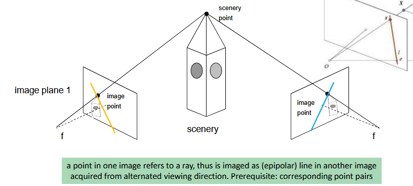

* **Stereo Matching**
    * Zwei nahe aneinanderliegende Kameras mit bekannter Distanz sind auf die selbe Szene gerichtet -> basierend auf dem Prinzip der menschlichen binokularen Tiefenwahrnehmung 
    * Disparitätskarte durch horizontale Verschiebung der Bildpunkte
    * Tiefe über Parallaxeneffekt (Verschiebung der Position eines Objekts, wenn es aus verschiedenen Blickwinkeln betrachtet wird)
    * Probleme bei niedriger Textur oder einfarbigen Flächen

    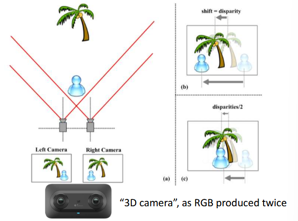

* **Bekannte Kameraposition - Silhouette Reconstruction**
    * Nutzung mehrerer Segmentierungsbilder (Silhouetten) zur Rekonstruktion der Visual Hull
    * Erfordert keine Punktkorrespondenz - nur binäre Segmentierungsmasken
    * Beispiel: Körpermodell aus 8 Kameraansichten (alle 45°), Person rotiert
    * Ergebnis: grob konvexe Form, konkave Teile nicht erfasst

    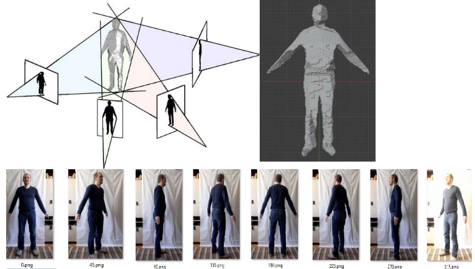

* **Structure from Motion (SfM)**
    * Aus vielen Bildern (z. B. Video von Drohne) wird:
        * Kamera-Position geschätzt
        * 3D-Struktur rekonstruiert
    * Funktioniert mit unbekannter Kameraposition
    * Beispiel: Gelände-Topografie aus Flugvideo
    * Bessere Ergebnisse als Silhouette Reconstruction möglich, wegen nicht senkrechter Sicht  
    * Skalierung bleibt oft unklar, kann aber mit GPS verbessert werden

> **Fazit:** Mit einzelnen monokularen Bildern kann man Tiefe nur approximieren, mit mehreren Bildern kann man echte 3D-Tiefe rekonstruieren.

---

**5.2 Nennen Sie Anwendungsgebiete der 3D Rekonstruktion. Geben Sie eine Definition für "3D Rekonstruktion" in eigenen Worten. Erläutern Sie, warum in 2D Bildern die Größe von Objekten nicht ableitbar ist**

**3D Rekonstruktion:** bezeichnet das Verfahren, bei dem aus Objekten oder Szenen aus 2D-Bildern, Videos oder anderen Sensordaten ein 3D-Modelle erstellt wird

**Anwendungsgebiete:**
- Medizin & Industrie
    - Diagnostik durch CT/MRT
    - 3D Modelle von Organen
- 3D printing, 3D modelling
- Bewegungserfassung
- AR/VR
- Robotik & Navigation
    - Pfadplanung 
    - Lokalisierung 
- ...

**Warum kann man aus einem 2D-Bild die Objektgröße nicht direkt ableiten?**
- In 2D-Bildern werden 3D-Szenen perspektivisch auf 2D-Fläche projiziert
- Dabei geht Tiefeninformation (in Z-Richtung) verloren
- Ohne zusätzliche Informationen (z. B. Kameraparameter, Referenzobjekte, ...) ist die reale Größe nicht berechenbar

---

**5.3 Führen Sie die Größenbestimmung in Bildern via Referenzobjekte aus. Erläutern Sie Shape from Shading.**
(Wiederholung von Teilen aus 5.1)

* **Größenbestimmung via Referenzobjekte - Size from orthogonal marker**
    * Maßstabsschätzung durch bekannte Objekte (z.B. Lineal, Checkerboard)
    * Wichtig für Kamera-Kalibrierung, forensische Anwendungen

* **Shape from shading (SfS)**
    * Physikalisches Modell hinsichtlich Lichtrichtung, Ansichtsrichtung und Oberflächeneigenschaften
    * Schätzung der Oberflächentiefe aus Helligkeitsverläufen
    * Nutzt verschiedene Reflektionsmodelle (z.B. Phong) -> kann reverse-engineered werden mit CGI
    * Ungefähre Annäherung der Gradienten / Topographie, aber keine absoluten Distanzen 

---

**5.4 Erläutern Sie Deep Depth from Focus. Erläutern Sie Shape from texture / structured light**
(Wiederholung von Teilen aus 5.1)

* **[Deep] Depth from Focus (DFF, DDFF)**
    * Idee: Objekte, die weiter weg sind, erscheinen unscharf auf dem Bild -> Tiefe aus der Bildschärfe
    * Funktioniert mit Fokus-Stapel -> mehrere Bilder mit verschiedenen Schärfeebenen
    * Schwierig erreichbar bei modernen Geräten (auto-focus mus deaktiviert werden)
    * Ergebnisse sind beeinflusst von Textur und Schatten

* **Shape from Texture: Structured Light**
    * Idee: Wenn eine regelmäßige Textur perspektivisch verzerrt ist, kann daraus Tiefe geschätzt werden.
    * Structured Light: Projektor + 2 Kameras + codiertes Lichtmuster
    * Probleme bei Okklusionen, daher hierarchische Rekonstruktion nötig
    * Alternative: Tiem of Flight (ToF)

---

**5.5 Führen Sie über den Einsatz von Deep Learning zur Bestimmung der Tiefe / 3D Form aus.**
(Wiederholung von Teilen aus 5.1)

* **Deep Learning**
    * Netzwerke schätzen relative Tiefe aus Bildinhalten
    * Nutzung von CNNs (z.B. U-Net), trainiert auf CGI-Daten
    * 2D–3D-Rekonstruktion über morphbare Modelle (z.B. Gesicht, Haare)

---

**5.6 Erläutern Sie Stereo Matching und Structure from Motion. Welche Bilder sind dafür gut geeignet? Erläutern Sie die Silhouette Reconstruction.**
(teilweise Wiederholung von Teilen aus 5.1)

* **Stereo Matching**
    * Zwei nahe aneinanderliegende Kameras mit bekannter Distanz sind auf die selbe Szene gerichtet -> basierend auf dem Prinzip der menschlichen binokularen Tiefenwahrnehmung 
    * Disparitätskarte durch horizontale Verschiebung der Bildpunkte
    * Tiefe über Parallaxeneffekt (Verschiebung der Position eines Objekts, wenn es aus verschiedenen Blickwinkeln betrachtet wird)
    * Ungeeignete Bilder: 
        * Texturarme/einfarbige Bereiche
    * Geeignete Bilder: 
        * Strukturreiche Szenen mit ausreichender Textur
        * Gleichmäßige Beleuchtung
        * Statische Szenen ohne Bewegung

* **Structure from Motion (SfM)**
    * Aus vielen Bildern (z. B. Video von Drohne) wird:
        * Kamera-Position geschätzt
        * 3D-Struktur rekonstruiert
    * Funktioniert mit unbekannter Kameraposition
    * Beispiel: Gelände-Topografie aus Flugvideo
    * Bessere Ergebnisse als Silhouette Reconstruction möglich, wegen nicht senkrechter Sicht  
    * Skalierung bleibt oft unklar, kann aber mit GPS verbessert werden
    * Geeignete Bilder: 
        * Verschiedenene Blickwinkeln
        * Nicht-orthogonale Ansichten für bessere Rekonstruktionsqualität
        * Überlappende Bildsequenzen
        * Strukturreiche Szenen
        * Gleichmäßige Beleuchtung

* **Bekannte Kameraposition - Silhouette Reconstruction**
    * Nutzung mehrerer Segmentierungsbilder (Silhouetten) zur Rekonstruktion der Visual Hull
    * Erfordert keine Punktkorrespondenz - nur binäre Segmentierungsmasken
    * Beispiel: Körpermodell aus 8 Kameraansichten (alle 45°), Person rotiert
    * Ergebnis: grob konvexe Form, konkave Teile nicht erfasst

---
## 6. Computer Vision and Machine Learning [9]

**6.1 Wofür werden Bilddatenbanken als „ground-truth“ benötigt.**

Ground-truth bedeutet die exakte Referenz, also eine genaue, verlässliche "Wahrheit" über Bildinhalte (z.B. korrekte Segmentierung, Klassifikation).

Bilddatenbanken mit Ground-truth werden gebraucht, um:
  * Algorithmen in der Computer Vision zu trainieren und zu testen.
  * Ergebnisse verschiedener Verfahren objektiv zu vergleichen.
  * Zu überprüfen, wie gut eine Methode wirklich arbeitet.

**Welche Daten sind dabei hilfreich (vgl. Bilddaten, Depth-from-Focus, 3D Rekonstruktion).**

* Bilddaten mit genauen Labels (z.B. was ist Objekt, Hintergrund, welche Klasse).
* Depth-from-Focus Daten: zusätzliche Tiefeninformationen, um Objekte besser zu unterscheiden.
* 3D Rekonstruktion: 3D-Modelle oder Volumen helfen, räumliche Strukturen exakt zu erfassen.

---

**6.2 Was sind die Fallstricke bei der Verwendung von Bilddatenbanken?**

* **Begrenzte Realitätsnähe:** Bilddatenbanken zeigen nur einen kleinen Ausschnitt der realen Welt, viele Situationen fehlen.
* **Qualität der Daten:** Ground-truth ist nicht immer korrekt oder vollständig, es gibt Fehler, Lücken und Verzerrungen.
* **Bias:** Bilder können z.B. bevorzugte Blickwinkel (Autos nur von der Seite) oder typische Posen enthalten, was das Training einseitig macht.
* **Redundanz:** Viele Daten enthalten sehr ähnliche oder gleiche Motive, was die Vielfalt einschränkt und Modelle überoptimiert auf diese speziellen Beispiele.
* **Visuelle Herausforderungen:** Probleme wie Schatten, Blendungen, Reflexionen, schlechte Beleuchtung oder Verdeckungen werden oft nicht oder nur unzureichend abgebildet.
* **Unterschiedliche Test- und Realitätsszenarien:** Algorithmen, die in Benchmarks gut abschneiden, können im echten Einsatz stark schlechter sein.

---

**6.3 Wie kann man Datenbanken „anreichern“, wenn nicht genügend Testdaten verfügbar sind?**

1. Datenaugmentation durch Transformationen:

* Bilder spiegeln (horizontal/vertikal)
* Helligkeit, Kontrast oder Farben verändern (z.B. Gamma-Korrektur)
* Affine Transformationen: drehen, verschieben, skalieren, verzerren
* Künstliches Hinzufügen von Rauschen oder Objekten
* Sub-Bilder (Ausschnitte) von wichtigen Bildteilen erstellen
* Ersetzen von Bildteilen, z.B. Gesichter in Videos austauschen
* Einfügen von computergenerierten Bildern (CGI) in bestehende Szenen

2. Automatisches Hinzufügen ähnlicher Bilder aus dem Internet:

* Bilder von Suchmaschinen (Google, Flickr) abrufen
* Automatische Annotation (Labeln) mit wenig manuellem Aufwand durch Ähnlichkeitssuche
* Schrittweise Erweiterung des Datensatzes basierend auf Ähnlichkeit (Feedback-Loop)

3. Transfer Learning mit vortrainierten Deep CNNs:

* Vortrainierte Netzwerke (z.B. auf ImageNet) als Ausgangspunkt nehmen
* Auf kleinere, domänenspezifische Datensätze (z.B. Blumenarten) weitertrainieren (Feinabstimmung)
* Vorteil: Gute Grundkenntnisse werden erweitert, es braucht weniger neue Daten

4. Nutzung von 3D-Modellen zur Generierung von Bildern:

* 3D-Objekte digital rendern (realistische Bilder erzeugen)
* Verschiedene Perspektiven und Posen simulieren (z.B. für Menschen, Fahrzeuge)
* Dadurch kann der Datensatz gezielt und vielfältig erweitert werden

**Was ist diesbezüglich der Vorteil/Nachteil von simulierten [Bild]daten?**

Vorteile von simulierten Bilddaten (z.B. aus 3D-Modellen)

* Kontrollierte Vielfalt: Man kann gezielt verschiedene Ansichten, Posen, Beleuchtungen erzeugen.
* Unbegrenzte Datenmenge: Es können beliebig viele Bilder generiert werden.
* Exakte Annotation: Da alles simuliert ist, sind Labels und Tiefeninformationen perfekt verfügbar.
* Geringerer Aufwand für manuelles Labeln.

Nachteile von simulierten Bilddaten

* Realitätslücke: Simulierte Bilder können von echten Bildern abweichen (Domänenunterschiede).
* Weniger natürliche Variationen: Manche Bildfehler oder Störungen fehlen (z.B. Kamerarauschen, Reflexionen).
* Aufwendige Erstellung: Hochrealistische 3D-Modelle und Rendering benötigen viel Aufwand und Rechenleistung.

---

**6.4 Führen Sie detailliert über Datenaugmentierung sowie Tools zur semi-automatischen Annotation von Bildern aus.**

Datenaugmentierung ist eine Methode, um vorhandene Bilddaten künstlich zu erweitern, indem Variationen der Originalbilder erzeugt werden. Ziel ist es, die Datenmenge zu erhöhen und gleichzeitig die Robustheit von Modellen gegen unterschiedliche Bildvariationen zu verbessern.

Methoden: Spiegeln, Drehen, Skalieren, Farb- und Kontraständerungen, Rauschen hinzufügen, Zufallsausschnitte.


Semi-automatische Annotation:
Der Computer schlägt automatische Annotationen vor, die der Mensch dann korrigiert oder bestätigt.

Tools: Polygon- oder Bounding-Box-Annotation (LabelMe, LabelImg), Superpixel-Segmentierung, Deep-Learning-Modelle für Vorschläge (Mask R-CNN, CVAT).

---

**6.5 Was ist ein U-NET?**

Ein U-Net ist ein Convolutional Neural Network (CNN) speziell für präzise Bildsegmentierung (z.B. in Medizin).

- Es basiert auf einem Encoder-Decoder-Prinzip:
    - Downsampling-Pfad (Encoder): extrahiert Merkmale durch Faltung (Convolution).
    - Upsampling-Pfad (Decoder): rekonstruiert Bildauflösung zur präzisen Segmentierung.
- Über Skip-Connections werden Feature Maps derselben Auflösung direkt verbunden -> ermöglicht präzise Lokalisierung bei gleichzeitigem semantischem Verständnis.
- Das Modell gibt meist eine Wahrscheinlichkeitskarte aus -> binäre Schwelle für endgültiges Segmentierungsergebnis notwendig.

<p float="center">
    
    
</p>


**Wie würden Sie dabei den Datenfluss mit RNNs bzw. LSTM vergleichen?**

- U-Net: Intra-sample Verbindungen -> verarbeitet räumliche Information innerhalb eines Bildes.
- RNNs/LSTMs: Inter-sample Verbindungen -> verarbeiten zeitliche Abhängigkeiten über mehrere Datenpunkte hinweg (z. B. bei Videos oder Sequenzen).
- Während U-Nets "horizontal" im Bild lernen, lernen LSTMs "vertikal" über Zeit oder Sequenzen hinweg.


**Welche Vorverarbeitungsschritte sind notwendig, bevor das Eingangssignal (z.B. Bild) dem Input-Layer übergeben werden kann?**

1. BLOB-Conversion:
- Alle Bilder müssen gleiche Größe, Farbtiefe und Wertebereich (z. B. 8-bit, 0–255) haben.
- Die Wahl der Interpolationsmethode beim Resizing (z. B. bilinear vs. nearest) hat Einfluss auf Ergebnisqualität.

2. Mean-Subtraction:
- Durchschnittswert des Bildes oder der Trainingsmenge wird abgezogen.
- Ziel: Farb- und Beleuchtungsunterschiede ausgleichen.
- Optional: Standardabweichungsskalierung zur Normalisierung über Kanäle hinweg.

3. Image Whitening (Zero Component Analysis):
- Zentriert die Daten (Mittelwert = 0),
- macht sie unkorreliert (durch Rotation),
- skaliert sie (durch Eigenwert-Normalisierung).
- Ziel: Reduktion von Redundanz und Korrelation in den Inputdaten, was das Lernen stabiler macht.

**Welche Auswirkung hat die Wahl der Vorverarbeitung auf das trainierte CNN?**
- Essentiell für die Trainingsqualität:
    - Falsche Vorverarbeitung -> schlechte Ergebnisse trotz guter Architektur.
- Gute Vorverarbeitung führt zu:
    - robusteren Modellen,
    - besserer Generalisation,
    - schnellerer und stabilerer Konvergenz.
- Spezielle Vorverarbeitung (z. B. Augmentation) kann Domänenwissen (z. B. Schnee im Wald) einfließen lassen.

---

**6.6 Nennen Sie Anwendungsgebiete für Deep Learning.**

* Allgemeine Computer Vision-Aufgaben:
    * Pose- und Aktivitätserkennung
    * Bildklassifikation, Segmentierung und Objekterkennung
* Spezifische Erkennungsaufgaben:
    * Gesichtserkennung und Emotionsklassifikation
    * Formbasierte Detektion/Klassifikation (z.B. für abstrakte Formen)
    * Personen-Detektion & -Tracking
    * Erkennung von Objekten im Kontext des autonomen Fahrens (z.B. Autos, Fahrzeuge)
    * Texterkennung (OCR)
    * Spracherkennung und natürliche Sprachverarbeitung
    * Human 3D Pose Estimation, Roboterwahrnehmung und Viewpoint Estimation unter Verwendung von 3D-Modellen
    * Klassifikation von Meta-Merkmalen wie der Anzahl von "Inseln" in Bildern
* Synthese und Generierung von Daten:
    * Bildsynthese mithilfe von GANs (Generative Adversarial Networks), z.B. für die Erzeugung von Trainingsbildern oder die Synthese von Gesichtern oder medizinischen Datensätzen.
    * Text-to-Speech-Synthese.

**Differenzieren Sie dabei zwischen Klassifikation und Segmentierung – was sind die Auswirkungen auf die Netzwerkarchitektur (input/output Layer)?**

* **Klassifikation:**
    * **Ziel:** Einer Eingabe (z.B. einem Bild) ein oder mehrere Labels (Klassen) zuordnen.
    * **Auswirkungen auf die Netzwerkarchitektur (Output Layer):** Bei der Klassifikation erzeugt die Ausgabeschicht des Convolutional Neural Networks (CNN) typischerweise nur Klassenlabels. Das bedeutet, das Netzwerk gibt eine Wahrscheinlichkeitsverteilung über vordefinierte Klassen aus (z.B. "Katze", "Hund", "Vogel").

* **Segmentierung:**
    * **Ziel:** Jedem Pixel eines Bildes eine Klasse zuweisen, um so Objekte oder Regionen exakt abzugrenzen.
    * **Auswirkungen auf die Netzwerkarchitektur (Input/Output Layer):** Für die Segmentierung wird die Bilddaten nach der Größenreduzierung wieder auf die ursprüngliche Auflösung hochskaliert, um eine finale Segmentierungsmaske zu erhalten.

**Was ist die Schwierigkeit bei der Verarbeitung von Eingangsdaten dynamischer Größe?**

Die Verarbeitung von Eingangsdaten dynamischer Größe (d.h., unterschiedlich große Bilder) stellt für viele Deep Learning-Modelle, insbesondere für Convolutional Neural Networks (CNNs), eine Herausforderung dar:

* **Feste Eingabegrößen:** CNNs sind typischerweise für eine spezifische Eingabebildgröße trainiert. Das bedeutet, dass alle Eingabebilder an diese vordefinierte Größe angepasst werden müssen, bevor sie in das Netzwerk eingespeist werden.
* **Preprocessing (BLOB-Konvertierung):** Der erste Schritt im Preprocessing für CNNs ist die BLOB-Konvertierung, bei der die Größe, die Pixeltiefe und der Skalarbereich aller Eingabebilder angepasst werden.
    * Die Wahl der Interpolationsstrategie während dieser Größenanpassung kann einen erheblichen Einfluss auf die erzielbare Ausgabequalität haben.

---

**6.7 Erläutern Sie das Prinzip von GANs und deren Einsatzgebiete.**

Generative Adversarial Networks (GANs) sind eine Art von neuronalen Netzen, die sich hervorragend zum Generieren von Daten eignen, wie zum Beispiel künstliche Musik oder künstliche Gemälde, die echten Werken ähneln. Das grundlegende Prinzip von GANs basiert auf einem **adversariellen (gegnerischen) Ansatz**, bei dem zwei neuronale Netzwerke in einem kontinuierlichen Wettstreit miteinander trainiert werden.

Diese beiden Netzwerke sind:
* Der **Generator**: Dieses Netzwerk hat die Aufgabe, eine sehr große Anzahl von Hypothesen (z.B. neue Bilder) zu generieren.
* Der **Diskriminator**: Dieses Netzwerk entscheidet, ob der vom Generator erzeugte Inhalt einem gegebenen Trainingsdatensatz ähnelt, d.h., ob er "echt" oder "gefälscht" ist.


**Der Trainingsprozess:**

Der Trainingsprozess ist ein dynamisches Gleichgewicht, bei dem sich beide Netzwerke **kontinuierlich verbessern**:
* Der **Generator** wird immer besser darin, überzeugendere Daten zu erzeugen, die den "Reality Check" des Diskriminators bestehen können.
* Der **Diskriminator** wird gleichzeitig immer besser darin, "schlechten" (künstlichen) Inhalt zu erkennen.

Dieser Prozess kann auch mithilfe eines **Multi-Resolution-Ansatzes** trainiert werden, insbesondere da die GAN-Gewichte sehr empfindlich auf Änderungen reagieren. Das Training erfolgt dabei in ansteigender Auflösung, beginnend beispielsweise von 4x4 Pixeln bis zu 128x128 Pixeln und höher.


**Einsatzgebiete von GANs:**

GANs finden in einer Vielzahl von Anwendungsgebieten Einsatz, insbesondere dort, wo die Synthese und Generierung von Daten im Vordergrund steht:
* **Bildsynthese**:
    * GANs können zur **Erzeugung von Trainingsbildern** verwendet werden, was den Bedarf an großen Mengen manuell annotierter Daten reduziert.
    * Ein prominentes Beispiel ist die **Gesichtssynthese**. Hierbei können GANs auf der Basis von beispielsweise 200.000 unausgerichteten RGB-Bildern von Prominenten trainiert werden, um realistische Gesichter zu generieren.
    * Die **Synthese medizinischer Datensätze** ist ein weiteres wichtiges Anwendungsgebiet. GANs ermöglichen das Training mit CT-Schnitten zusammen mit zugehörigen Ground-Truth-Segmentierungen. Dies stellt eine ausgezeichnete Alternative dar, wenn nicht genügend Trainingsdaten vorhanden sind.
* **Text-to-Speech-Synthese**

---

**6.8 Diskutieren Sie die Bedeutung und Anwendungsgebiete von Yolo.**

**YOLO** (You Only Look Once) ist eine Architektur für die **Objektdetektion in Echtzeit**. Es wurde entwickelt, um Objekte in Bildern nicht nur zu klassifizieren, sondern auch deren genaue Position und Größe mittels **Bounding Boxes** zu lokalisieren.


Die Kernidee von YOLO ist, dass ein Eingabebild in ein **Raster unterteilt** wird. Jede Zelle in diesem Raster ist dafür verantwortlich, ein Objekt zu detektieren. Dabei werden für jedes Rasterfeld **Begrenzungsrahmen (Bounding Boxes)** und **Objektklassen-Wahrscheinlichkeiten** erkannt. Die Begrenzungsrahmen werden dann basierend auf ihrer Konfidenz gefiltert.

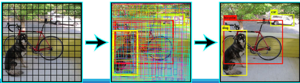

Anwendungsfälle:
- Echtzeit Objektdetektion
- z.B. erkennen von Baumstämmen in einem Bild

---

**6.9 Diskutieren Sie die Bedeutung der Vorverarbeitung, wenn Bilddaten in den Eingangstensor überführt werden.**

* Vorverarbeitung ist Grundlage für plausible, robuste und präzise Ergebnisse.
* Anpassung an das CNN-Layout: Die gewählte Vorverarbeitungsstrategie muss stark vom Layout des CNNs und der Art und Weise, wie die Regionen von Interesse (ROIs) der Eingabebilder in das Netzwerk eingespeist werden, abhängen.
* **Standardisierung des Inputs (BLOB-Konvertierung):**
    * Anpassung von Größe, Pixeltiefe und Skalarbereich aller Eingabebilder.
    * Die Wahl der Interpolationsstrategie kann die erreichbare Ausgabequalität erheblich beeinflussen.
* **Farb-/Helligkeitsnormalisierung (Mittelwert-Subtraktion):**
    * Durch das Subtrahieren des Mittelwerts des Bildes wird eine normierte Skala erreicht.
    * Dies gleicht Helligkeitsänderungen in den Datensätzen aus.
    * Zusätzlich kann eine Skalierung durch die Standardabweichung angewendet werden, um gleiche Wertebereiche pro Kanal zu gewährleisten.
* **Merkmalsverstärkung (Image Whitening):**
    * Diese Methode, auch Zero Component Analysis genannt, transformiert die Daten so, dass die Kovarianzmatrix der Einheitsmatrix entspricht.
    * Dazu werden die Daten null-zentriert, entkorreliert (rotiert, bis keine Korrelation mehr besteht) und neu skaliert.


**Was könnte dabei schiefgehen?**

* **Inadäquate Strategiewahl:** Wenn eine ungeeignete Vorverarbeitungsstrategie gewählt wird, können schwache Ergebnisse die Folge sein.
* **Falsche Interpolation:** Eine schlechte Wahl der Interpolationsstrategie während der BLOB-Konvertierung kann die Ausgabequalität signifikant beeinträchtigen.
* **Mangelnde Repräsentativität des Datensatzes:** Auch umfassende Datensätze decken oft nur einen sehr kleinen Teil der realen Welt ab.
* **Qualität und Korrektheit der Referenzdaten:** Die Qualität und Korrektheit der zugrundeliegenden Referenzdatensätze (Ground Truth) wird selten selbst evaluiert. Dies kann zu Redundanzen, Lücken und Fehlern im Ground Truth führen, die einen Bias einführen.
* **Herausfordernde Bildmerkmale:** Die Algorithmen können bei Bildern mit geringem Kontrast, Schatten, Blendung, Reflexionen, verwirrenden Texturen und Okklusionen Schwierigkeiten haben.
* **Bias in Orientierungen oder Inhalten:** Ein Bias hinsichtlich bevorzugter Orientierungen (z.B. Autos immer von der Seite) oder Redundanzen im Inhalt.

---